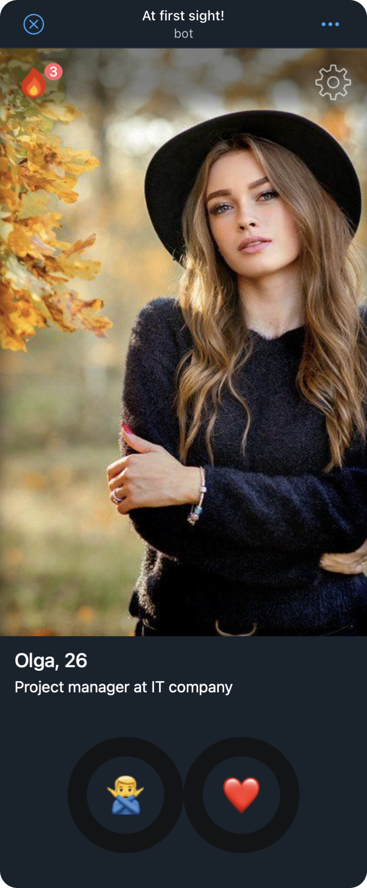
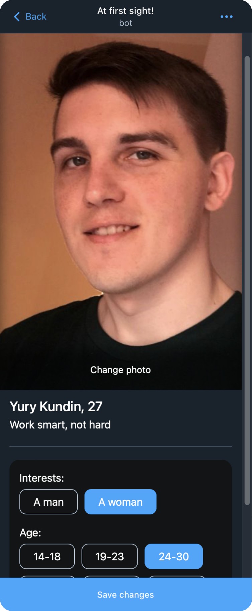

# At first sight!

This repository contains an example of the Telegram Web App, which allows you to find your soulmate literally at first sight!
Open an real example in Telegram — [@at_first_sight_bot](https://t.me/at_first_sight_bot)

##### For users:

- Create your dating profile, which includes several photos and detailed information about yourself;
- Evaluate other users who fit your interests and are nearby;
- See all the users with whom your sympathy turned out to be mutual and continue communicating in the best messenger in the world — Telegram — in one click;
- Get additional conditions inside the app by buying a Premium subscription right inside the messenger

##### For developers:

- Detailed step-by-step instructions for developing a complex multifunctional application that is designed for millions of users;
- Microservice architecture of the application, where each service performs its own strictly defined task, which can be developed by different people. You will understand exactly what tasks the designer, Backend-developer, Frontend-developer performs and what unites them;
- A modern stack of technologies for developing the Frontend-part of the application, which is suitable for almost any Telegram Web App, as well as for creating a modern website;
- An example of the Backend part, which consists of a REST API, working with a database and saving thousands of files. And all this without using any frameworks, the study of which takes a lot of time;

### First run of project

This repository has client and server code, but also several infrastructure services, such as a MongoDB database, Minio object storage, and a server for proxying images from this storage. The entire set of services is started with a single command using Docker, but before that you need to create the necessary configuration files (as a rule, this is done only once).

[Instruction for first run project](./docs/en/00-first-run.md)

### What won't we consider?

Since this repository was created to participate in the [Telegram Mini App Contest](https://t.me/contest/327) and the result must be sent on October 10, 2023, then some of the topics will intentionally not be affected by us. They will be quite important if you really intend to create an application for a huge audience of users or assemble a development team for this.

- **Testing** — the larger the audience of your application and the wider the capabilities of your application, the more important the testing process becomes. Take this seriously and study this topic, especially in the case when you will provide users with paid features and earn money from it.

- **Performance monitoring** — Even a well-tested application may unexpectedly break down due to circumstances beyond your control. You need to set up monitoring of important metrics of your application and set up a notification system if something suddenly starts to differ greatly from the norm.

- **Teamwork** — if you plan to actively develop and change the application, then most likely you need to think about selecting a team and setting up a project for teamwork. For example, this may consist in setting up CI/CD pipelines that will allow you to automatically monitor the quality of the code, review the code and automatically deploy it to the servers…

### Step-by-step guide how to create Telegram Web App

I always suggest starting the development of a new product (application) with the formulation of the key idea and the values that we will offer to our audience. After that, we should start carefully thinking through all the necessary features that we want to present to users in the first version in order to hook them at first sight!

This whole process can be described in one word — design — and it is the first step in our instructions, which is presented on a separate page.

- Instruction for first run project / [in English](./docs/en/00-first-run.md) / [на русском языке](./docs/ru/00-first-run.md)
- Design / [in English](./docs/en/01-design.md) / [на русском языке](./docs/ru/01-design.md)
- Project Setup / [in English](./docs/en/02-settings.md) / [на русском языке](./docs/ru/02-settings.md)
- Creating a project for the frontend / [in English](./docs/ru/03-create-frontend-project.md) / [на русском языке](./docs/ru/03-create-frontend-project.md)
- Interface development / [in English](./docs/en/04-develop-interface.md) / [на русском языке](./docs/ru/04-develop-interface.md)
- Detailed study of the interface / [in English](./docs/en/05-interface-details.md) / [на русском языке](./docs/ru/05-interface-details.md)
- Preparing the backend for the application / [in English](./docs/en/06-prepare-backend.md) / [на русском языке](./docs/ru/06-prepare-backend.md)
- Registration and authorization / [in English](./docs/en/07-auth-reg.md) / [на русском языке](./docs/ru/07-auth-reg.md)
- Payments inside Telegram Web App / [in English](./docs/en/08-payments.md) / [на русском языке](./docs/ru/08-payments.md)

### About author

### Yury Kundin

A web developer from Vladimir, who started his way into IT with the development of interfaces, got bored and went further — backend on NodeJS and infrastructure.

In the last year, I have also been interested in participating in the development of a full-fledged product, and not just in writing code. This task is very interesting in this regard, especially considering the fact that I was able to devote only about 3 days to development.

My Social Networks: [Telegram](https://t.me/ykundin), [VK](https://vk.com/ykundin), [Instagram](https://www.instagram.com/y.kundin)

You can support this project and send a TON to: `UQDfxJZfif_MoaMBzzeUOTenOvpdm78La5LFkAtmzxv11StN`
