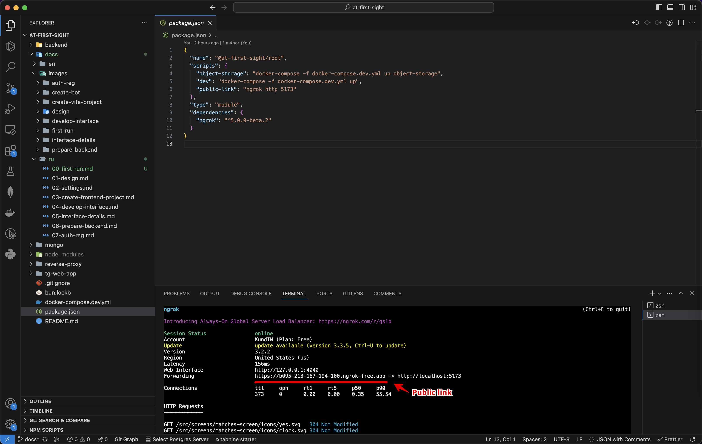

# At first sight! / First launch

This repository has client and server code, but also several infrastructure services, such as a MongoDB database, Minio object storage, and a server for proxying images from this storage. The entire set of services is started with a single command using Docker, but before that you need to create the necessary configuration files (as a rule, this is done only once).

## Installing Docker

Since Docker is used to deploy microservices, first of all it must be installed on the computer. Docker is available for Windows, Linux and macOS, and detailed installation instructions are on the official website.

[Installation Instructions](https://docs.docker.com/engine/install)

## 1. We get a public link to the application



In order to launch the application inside Telegram, you will need a public link to this application. In production mode, this link is your domain, and locally we will use Ngrok. Run the following commands in your terminal:

```bash
npm i
npm run public-link
```

Do not close this terminal, otherwise the link will stop working. Instead, open a new tab in the terminal and continue there.

## 2. Getting access to file storage

The application uses Minio to store user photos, but at the first launch we need to get the data to access it.

```bash
npm run object-storage
```

Then open the page [http://localhost:9001 ](http://localhost:9001) and log in using the username `kundin` and password `very-secret-password` (configured in `docker-compose.dev.yml`).

- Create an access key (Access Keys => Create access key) and save, they will be needed later;
- Create a new bucket for storing files (Object Browser => Create a Bucket), name it `at-first-sight`;
- Done, press `Ctrl +C` in the terminal to stop the application.

## 3. Create a file with access

And now create a `.env` file that will store absolutely all the necessary accesses for the application, for example:

```bash
PUBLIC_URL=https://b095-213-167-194-100.ngrok-free.app # Public url from first step

# Telegram
TELEGRAM_BOT_API=6406180840:AAFpHYAa-V5IMDM67kef2tbScxCX8PpKyjA # Token for your bot from @BotFather
TELEGRAM_YOOKASSA_TOKEN=381764678:TEST:68380 # Payment provider token from @BotFather

# Mongo DB
MONGO_INITDB_ROOT_USERNAME=kundin
MONGO_INITDB_ROOT_PASSWORD=very-secret-password
MONGODB_DATABASE=at-first-sight
MONGO_URI=mongodb://kundin:very-secret-password@db:27017/?authSource=admin&readPreference=primary&ssl=false&directConnection=true
MONGO_DB=at-first-sight

# Object storage data from second step
AWS_BUCKET=at-first-sight
AWS_ACCESS_KEY_ID=nZmM2Np3dfaX8wglU1Py
AWS_SECRET_ACCESS_KEY=L9VvkRFiW0b5Ak4Q2KbIbYNVYLPsd5KssWn1l3rK
```

## 4. Launch already!

Add a public link in your bot's settings, after which you can already open your bot and launch the Web App.

Please note that the entire application will be launched in development mode, so if you edit the code of the client or server part of the project, the changes will be applied almost instantly.

GL HF! ;)
