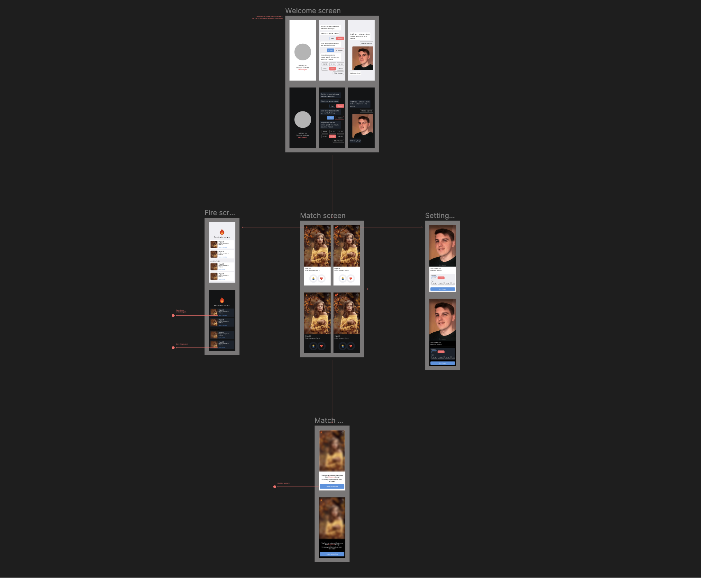
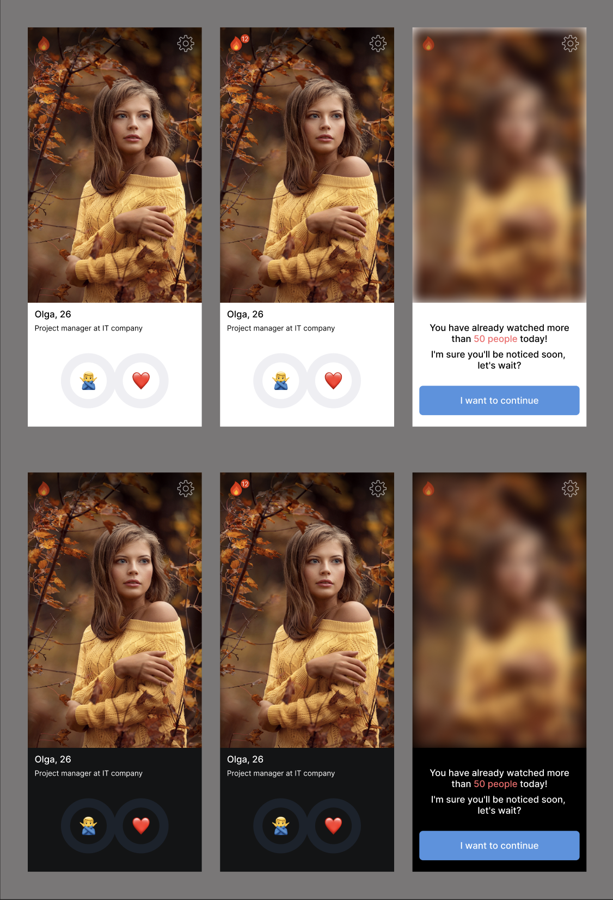
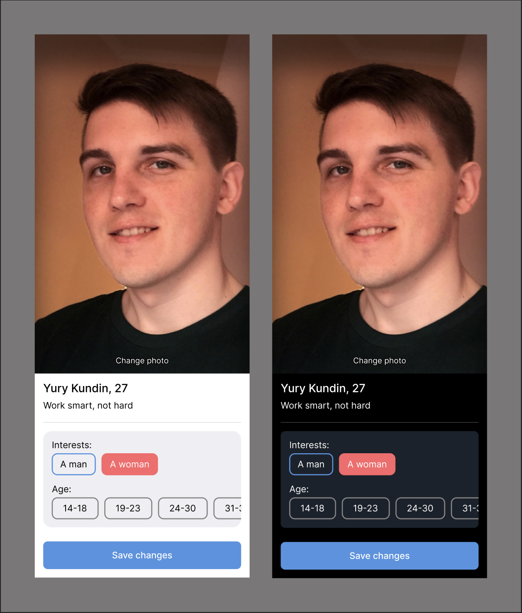

# At first sight! / Design

At this stage, it is necessary to think over the prototype of the application and its first minimum possible version, which will carry value for the user.
In no case do I recommend starting development right away, hoping that decisions will be made on the go. As a rule, thinking through the design of an application
allows you to significantly reduce the development time, immediately identify bottlenecks or lay down a specific architecture.

### Minimal functionality

1. The user can create his profile, which will be used to show other users for dating purposes;
2. The user can edit his profile at any time without restrictions;
3. The user can rate other profiles in the format "Liked" / "Disliked";
4. If the opinions of two users coincide about each other, then both receive a notification and are displayed in a separate list;
5. The user can start a dialogue with people if their opinions coincide;
6. The user sees the profiles of those who rated him positively, but it's not mutual yet. Such a profile is closed and to open it there are two possible options: a) make a payment, b) accidentally stumble upon it and mutually evaluate;
7. If the user has evaluated more than 50 people per day, then access to the evaluation is temporarily blocked, but the restriction can be removed by making a payment.

### Design

Now we need to design the interface in the form of several screens that will allow us to implement this functionality and think about navigation inside the application. As a rule, in modern development, Figma is most often used for this, a tool that is familiar to every design, but which is quite simple even for those people who open it for the first time.

Figma is free and available in an online format, so you can see the result directly from the link.

[Open Layout](https://www.figma.com/file/Zg8AVusk4C620Vsvy7uiyu/At-first-sight!?type=design&node-id=0%3A1&mode=design&t=qsCjvDPdpzYcKCqL-1)

### Application Screens

The entire application currently consists of 4 screens, each of which performs a specific task and between which the user can navigate.
Let's take a closer look at each of them.

#### Acquaintance

This screen is shown to the user only when using the application for the first time and serves as a profile registration form. On this screen, in the format of a dialogue with the user, we find out his interests, age and allow him to upload his own photo.

After that, the user is saved in our database and never gets to this screen again. The list of questions may change over time and be selected in such a way as to implement the search for the selection of people interesting to the user as accurately as possible. All this may be one of the further directions of application development, but it will not be discussed within this repository.

After completing the registration process, the user gets to the next screen, which is the main one.

 

#### Search for interesting people

It is on this screen that the user will spend the most time in the application, evaluating other people who have been matched to his interests.
A few important points:

- On top there are notifications in the form of a light and an icon in the form of a gear, which serves as a transition to other screens;
- The user can evaluate no more than 50 people per day in order to avoid spam, cheating and encourage the user to be more attentive to the elections;
- If the limit is reached, then you cannot view other people. But the user can remove the restriction by making a payment inside the application;

I hope that on this screen you have also already realized that the first version of the application will immediately have both a dark and a light theme? Telegram Web App allows you to automatically adjust the display to the theme that is selected by the user on the phone and it is also worth immediately laying in the design!

 

#### Settings

Next, we need to think about the fact that over time the user's interests may change, or he will want to change the photo. And for this purpose we have a separate screen with settings, which is accessible by clicking on the gear.

From the interesting — the button for saving changes will be implemented in the form of [MainButton](https://core.telegram.org/bots/webapps#mainbutton), which is provided by Telegram itself, so the appearance will be slightly different. By clicking on it, the user can save the changes and immediately return to the main screen of the application.

 

#### Viewing Matches

And finally, the most intriguing application screen that lights a flame in the heart! You can get to it only if there is at least one coincidence of interests and you can immediately start a dialogue with such people in Telegram. But if someone has shown sympathy for you, and you have not yet met such a person on the search screen, then the application will show him in the list. However, a photo to the user and the opportunity to write to him can be obtained only after the payment.

This is the end of the design of the first version and you can start working on these interfaces from the technical side. To begin with, let's start by preparing the project for further work, this process is described on a separate page.

[Project Setup](./02-settings.md)
