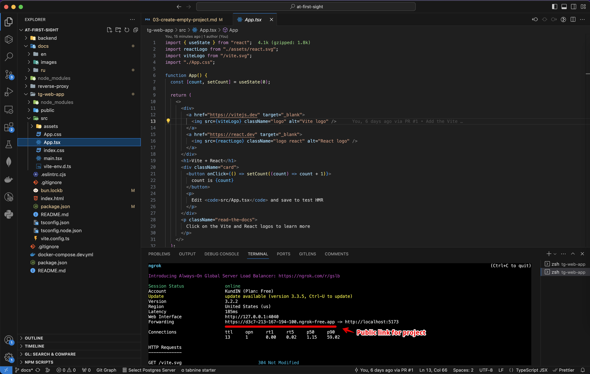
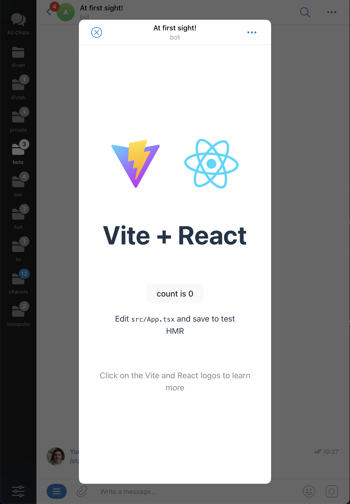

# At first sight! / Creating a project for the frontend

At this stage, our task is to create a project template and run it directly inside Telegram in the form of an application. We believe that our application will be actively developed and refined, so we will immediately choose a good and proven solution for the frontend in the form of [Vite](https://vitejs.dev) and [React](https://react.dev).

## Creating a Vite + React project

To do this, run the following command from the terminal

```bash
bun create vite tg-web-app
```

In response, we will be asked to select several options from the list, I suggest choosing the following — `React`, `TypeScript` (using the arrows on the keyboard and pressing Enter)

## Project launches


After the project is created, we will be asked to execute the following set of commands that need to be executed in the terminal one by one.

```bash
cd tg-web-app # go to the directory with the project
bun install # install dependencies
bun run dev # launches a project in development mode
```

As a result, you will see a message that the project has been successfully launched at [http://localhost:5173](http://localhost:5173) and it can already be opened in the browser.

If this port was occupied by another program, then Vite will automatically find the nearest free port and run it on it.

## Public access to the project

At the moment, our project can only be opened from our computer on `localhost`, but to open it inside Telegram, you will need public access to the project via HTTPS. When the development stage is completed, we will upload the project to our domain and server and this will not be a problem. But what to do in development mode? I offer two options:

#### Built-in VSCode capability


Not so long ago, inside VSCode, it became possible to get a public link to any port that we need.
To do this, we need to open the Ports panel, click on `Forward a Port` and specify the port on which our project is running (in our case 5173). After a short wait, VSCode will generate a unique public link for us, by which our project will be available to any user on the Internet.

Moreover, it is also convenient for us to develop a project, since any changes to the code inside the components will be displayed almost instantly on the page. The only disadvantage of this method is that when you go to this page, you need to log in using Github.

#### Using Ngrok



If you use a different code editor or for some other reason the first method does not suit you, then there are other solutions for this task, for example, [Ngrok](https://ngrok.com).

1. Install the necessary dependencies

```bash
bun add -D ngrok
```

2. Update the script to launch the project

```bash
# file tg-web-app/package.json

"scripts": {
...
"public-link": "ngrok http 5173",
...
}
```

3. Restart the project

```bash
bun run dev
bun run public-link # in a separate terminal window
```

Now our project will also be launched at http://localhost:5173 , but additionally Ngrok will create a public address for our project and show all the necessary information in the terminal.

Please note that now commands need to be executed in separate terminal windows and a new unique link will be generated at each restart. A little later we will make a more convenient launch of the project.

## Opening a project inside Telegram



We are ready to start integrating the project into Telegram and open our application already inside our own bot by clicking the button. This can be implemented without writing code using the already known to us [@BotFather](https://t.me/BotFather)

1. Send the command `/mybots`
2. Select the desired bot from the list (in my case, this is `@at_first_sight_bot`)
3. Next, select `Bot Settings`
4. Then `Menu Button`
5. Then `Configure menu button`
6. Finally, we will be asked to enter the public address of the project that we received using VSCode or Ngrok in the previous step.
   I point out `https://cbd8-213-167-194-100.ngrok-free.app `, you will have another
7. Next, enter the name of the button, for example, "Meet"
8. Everything! Go to your bot and open the application.

<br clear="right"/>

## Initializing the Mini App

The only thing left to do is to add a Telegram JS script to the project in order to get access to all the features that are described in [Telegram Mini Apps documentation](https://core.telegram.org/bots/webapps#initializing-mini-apps). This is done quite simply, just insert the script into the file `index.html `

```html
<!DOCTYPE html>
<html lang="en">
  <head>
    <meta charset="UTF-8" />
    <meta name="viewport" content="width=device-width, initial-scale=1.0" />
    <script src="https://telegram.org/js/telegram-web-app.js"></script>
    <title>At first sight!</title>
  </head>

  <body>
    <div id="root"></div>
    <script type="module" src="/src/main.tsx"></script>
  </body>
</html>
```

After completing these settings, we can make changes to the project code and they will immediately be displayed inside the Telegram Web App even without restarting the application. This is enough to distract from the settings and finally start implementing our idea!

[Developing the application interface](./04-develop-interface.md)
