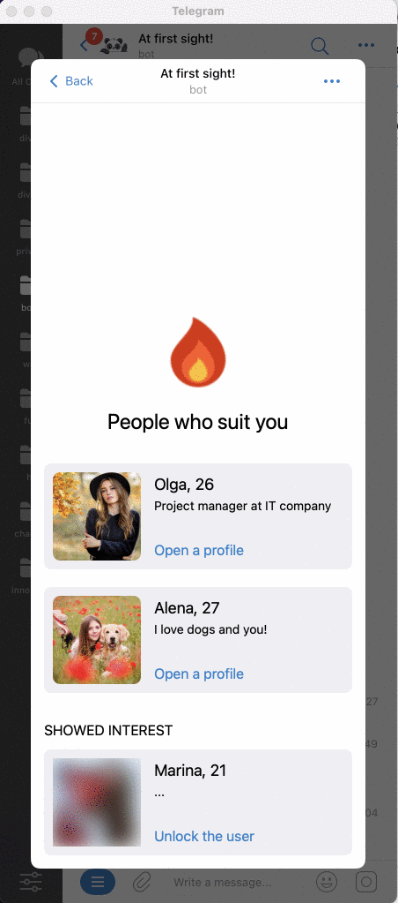

# At first sight! / Developing the interface

This is a fairly large development stage, within which you and I need to develop the entire application interface and the screens that were created at the application design stage. It is assumed that you know TypeScript and React pretty well, because we will not analyze each of the interface components in detail (but you can always see the final result right in this repository).

But we will analyze in detail a lot of interface features that Telegram provides us with:

- Work with two themes — light and dark;
- Display of the main application button;
- How to open native popups inside the app;
- Using tactile response in the interface;
- Navigation between the application screens using the "Back" button.

## Basic navigation

One of the key mechanics that is found in most applications and websites, which allows you to create many pages/screens and navigate between them. For this purpose, I will use a proven and very well—known library - [React Router](https://reactrouter.com/en/main/start/tutorial#setup).

1. **Install the library**

   ```bash
   # inside the tg-web-app
   bun install react-router-dom
   ```

2. **Creating empty application screens**

   Let's create a `screens` directory inside the application, which will contain each screen of the application:

   - `welcome-screen` — introduction and user registration;
   - `matches-screen` — search for interesting people;
   - `settings-screen' — screen with settings, profile editing;
   - `fire-screen' — viewing matches;

   [View code](https://github.com/ykundin/at-first-sight/tree/docs/tg-web-app/src/screens)

3. **Adding routing inside the application**

   To do this, we remove all template information from the file `./src/App.tsx` and add routing rules that bind the application screen to the desired address (we determine the address ourselves). And it is also advisable to immediately remove the unnecessary CSS code that was in the project template in the files `App.css` and `index.css`

   ```tsx
   import { createBrowserRouter, RouterProvider } from "react-router-dom";

   import WelcomeScreen from "./screens/welcome-screen";
   import MatchesScreen from "./screens/matches-screen";
   import SettingsScreen from "./screens/settings-screen";
   import FireScreen from "./screens/fire-screen";

   function App() {
     const router = createBrowserRouter([
       {
         path: "/",
         element: <WelcomeScreen />,
       },
       {
         path: "/matches",
         element: <MatchesScreen />,
       },
       {
         path: "/settings",
         element: <SettingsScreen />,
       },
       {
         path: "/fire",
         element: <FireScreen />,
       },
     ]);

     return <RouterProvider router={router} />;
   }

   export default App;
   ```

4. **Add links to each screen**

   

   And now let's test that we can open each screen of the application by clicking on the link to it. To do this, it is enough to use the `Link` component from the same React Router package. For example, like this:

   ```tsx
   import { Link } from "react-router-dom";
   import styles from "./matches-screen.module.css";

   import type { FC } from "react";

   const MatchesScreen: FC = () => {
     return (
       <div className={styles.screen}>
         <span>Matches Screen!</span>
         <Link to="/fire">Go to fire screen</Link>
         <Link to="/settings">Go to settings screen</Link>
       </div>
     );
   };

   export default MatchesScreen;
   ```

<br clear="right"/>

## Built-in Back button


As we can see from the example above, some of the screens should return us to the previous screen. For example, if you went to the matches screen, then you should have a "Back" button that will return the user to the previous screen with the search for people. And instead of placing such a button in the design, we can use a native, familiar-looking button that Telegram itself provides us with.

[BackButton Documentation](https://core.telegram.org/bots/webapps#backbutton)

I will do this on the `fire-screen` and `settings-screen` screens, here is an example implementation:

```tsx
import { useEffect } from "react";
import { useNavigate } from "react-router-dom";
import styles from "./fire-screen.module.css";

import type { FC } from "react";

const FireScreen: FC = () => {
  const navigate = useNavigate();

  useEffect(() => {
    // eslint-disable-next-line @typescript-eslint/no-explicit-any
    const webApp = (window as any).Telegram.WebApp;

    // Show the back button
    webApp.BackButton.show();

    // Hide back button by click and go to Matches screen
    webApp.BackButton.onClick(() => {
      webApp.BackButton.hide();
      navigate("/matches");
    });
  }, [navigate]);

  return (
    <div className={styles.screen}>
      <span>Fire Screen!</span>
    </div>
  );
};

export default FireScreen;
```

## Making up the interface


And now let's try to make up the application screens in a static version and check that navigation still works as intended. This part of the work does not depend on Telegram and here you will need skills working with React, CSS and TypeScript.

For example, I did not make up the `welcome-screen` so that you understand that the mechanism of navigation between screens has not changed in any way, I just filled these screens with static content in the form that was made at the design stage. You can always view the final code of each screen right inside this repository.

[View code](https://github.com/ykundin/at-first-sight/tree/docs/tg-web-app/src/screens)

## Working with the main button

Have you noticed that there is a "Save changes" button on the settings screen? This is another of the built-in features of the Telegram Mini App, called [MainButton](https://core.telegram.org/bots/webapps#mainbutton), working with which is very similar to BackButton. Let's take an example:

```tsx
const SettingsScreen: FC = () => {
  const navigate = useNavigate();

  const handleSave = useCallback(() => {
    console.log("Save the changes...");
    navigate("/matches");
  }, [navigate]);

  useEffect(() => {
    // eslint-disable-next-line @typescript-eslint/no-explicit-any
    const webApp = (window as any).Telegram.WebApp;
    const cleanup = () => {
      webApp.MainButton.hide();
      webApp.MainButton.offClick(handleSave);
    };

    // Show the main button
    webApp.MainButton.show();
    webApp.MainButton.setText("Save changes");

    // Open the payment by click
    webApp.MainButton.onClick(handleSave);

    return cleanup;
  }, [handleSave]);

  return ....;
});
```

In this case, we simply log clicking on this button and immediately return to the main screen. But in the future, it is here that the code will be written that saves all the profile changes made by the user.

Pay attention to the `cleanup` function — it will be automatically called when the component is unmounted and allows you to hide the button and unsubscribe from the event that occurs when you click on it. If this is not done, the button will be displayed even if the user switches to another application screen.

## Opening a link inside Telegram



But on the screen with matches, we allow the user to immediately start a dialogue with the person with whom the sympathy coincided. To do this, Telegram Mini App has another function, let's look at it in action:

```tsx
const PeopleCard: FC<PeopleCardProps> = (props) => {
  const { people, ...restProps } = props;

  const handleOpenProfile = useCallback(() => {
    // eslint-disable-next-line @typescript-eslint/no-explicit-any
    const webApp = (window as any).Telegram.WebApp;

    // Link on user, for example https://t.me/ykundin
    webApp.openTelegramLink(people.link);
  }, [people.link]);

  return (
    <div {...restProps} className={styles.card}>
      <div className={styles.footer}>
        <span className={styles.link} onClick={handleOpenProfile}>
          Open a profile
        </span>
      </div>
    </div>
  );
};
```

Please note that in this case the application will be closed automatically. And there is also a link "Unlock the user", which, according to the idea, should give access to the user's profile only after making a payment — this part requires a backend, so its implementation will be shown later.

This completes the creation of the main interface, but there is still a lot to do, for example, to learn how to work with design themes and tactile response.

[Detailed study of the interface](./05-interface-details.md)
