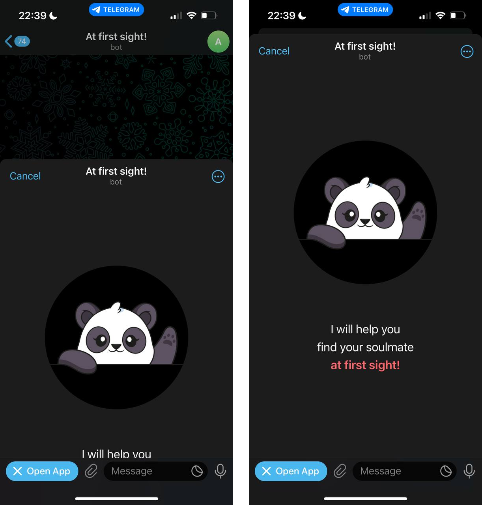

# At first sight! / Detailed study of the interface

At this stage of the work, we have to work out the existing interface in more detail. This will not affect the mechanics that have already been developed, but it will add more life and emotions to the interface in order to form a desire for users to look into the application more often!

## Design themes


In the modern world, a huge number of websites and applications already have both light and dark themes, including Telegram. And it will not be very good if we blind users of a dark theme with our light background.

Telegram provides several ready-made CSS variables that will automatically change their value during theme switching on the user's device. It remains only to add them to the application and use them during the styling of components.

To begin with, let's declare all the variables in one `index.css` file:

```css
:root {
  /* Custom variables */
  --app-brand-color: #fd6569;
  --app-gender-man-color: #4e92e2;
  --app-gender-woman-color: #fd6569;

  /* Default variables by Telegram */
  --app-bg-color: var(--tg-theme-bg-color);
  --app-secondary-bg-color: var(--tg-theme-secondary-bg-color);
  --app-text-color: var(--tg-theme-text-color);
  --app-hint-color: var(--tg-theme-hint-color);
  --app-link-color: var(--tg-theme-link-color);
  --app-button-color: var(--tg-theme-button-color);
  --app-button-text-color: var(--tg-theme-button-text);
}
```

And then in the component code we will use them as follows, for example:

```css
.component {
  color: var(--app-text-color);
  border: 1px solid var(--app-hint-color);
}
```

## Getting a theme using TypeScript

Quite often, you may want to work with a theme not only at the CSS level, but also inside TypeScript code to get the user's currently selected theme or individual colors of his design theme. All this is also provided by Telegram and is described in the [official documentation](https://core.telegram.org/bots/webapps#themeparams).

There is no need for this in this application, so I will limit myself to just a couple of code examples.

First, we get the current user theme and its parameters:

```tsx
const webApp = window.Telegram.WebApp;

console.log("color scheme", webApp.colorScheme); // dark or light

console.log("params", webApp.themeParams); // {
// bg_color: "#18222d"
// button_color: "#2ea6ff"
// button_text_color: "#ffffff"
// hint_color: "#b1c3d5"
// link_color: "#62bcf9"
// secondary_bg_color: "#131415"
// text_color: "#ffffff"
// }
```

And this is how you can subscribe to an event about changing the theme:

```tsx
const webApp = window.Telegram.WebApp;

webApp.onEvent("themeChanged", function () {
  console.log("Current theme:", this.colorScheme);
});
```

## Tactile response to action

Another interesting feature that Telegram provides is working with tactile response. On a computer, you won't notice the difference, but phone users will feel a slight vibration in response to an action with the interface.

For example, I will add a tactile response to changing any parameters in the settings, as well as to the "Liked"/ "Disliked" buttons on the person search screen. Visually, this change cannot be shown, so log in to the bot from your phone and try it live — [@at_first_sight_bot](https://t.me/at_first_sight_bot).

And this is how it looks inside the code:

```tsx
function onClick() {
  // eslint-disable-next-line @typescript-eslint/no-explicit-any
  const webApp = (window as any).Telegram.WebApp;
  webApp.HapticFeedback.selectionChanged();
}
```

[View full код](https://github.com/ykundin/at-first-sight/blob/docs/tg-web-app/src/ui/radio-buttons/radio-buttons.tsx)

## Full screen opening



By default, the application does not open to users in full screen and they need to deploy it completely on their own. But in many cases, this is just an unnecessary action and Telegram allows you to immediately open the application to full screen (the difference is shown in the screenshot).

This is done quite easily, it is enough only to call the following code when loading the application. I suggest doing this in the `App.tsx` file:

```tsx
function App() {
  useEffect(() => {
    const webApp = window.Telegram.WebApp;

    webApp.ready();
    webApp.expand();
  }, []);

  const router = createBrowserRouter(...);

  return <RouterProvider router={router} />;
}
```

Of course, this is not all that Telegram allows you to do in terms of the interface, many things can be worked out and made much more convenient, and you can already think about how to refactor some parts of the code. But I tend to take this approach in order to first get a working version of the application, and then do similar things.

Our application is hardly useful at this stage — it displays only static information. This means that it's time to start developing a backend, learn how to get user information from Telegram, save it to a database, work with payments inside the application, and much more!

[Preparing the backend for the application](./06-prepare-backend.md)
