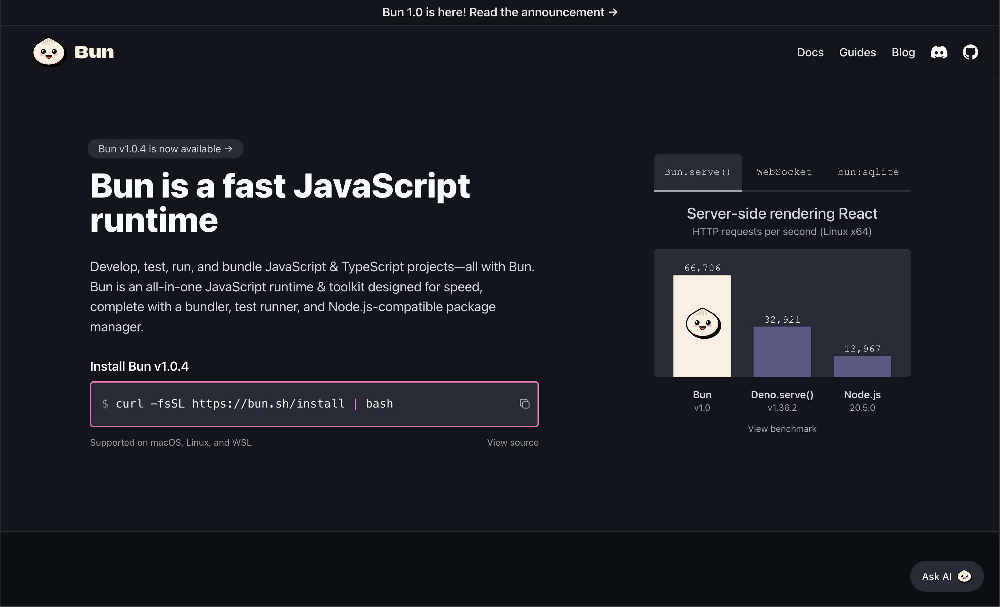
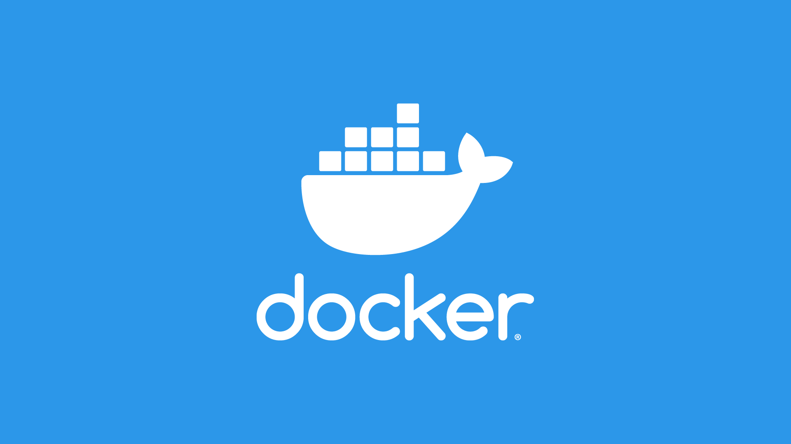
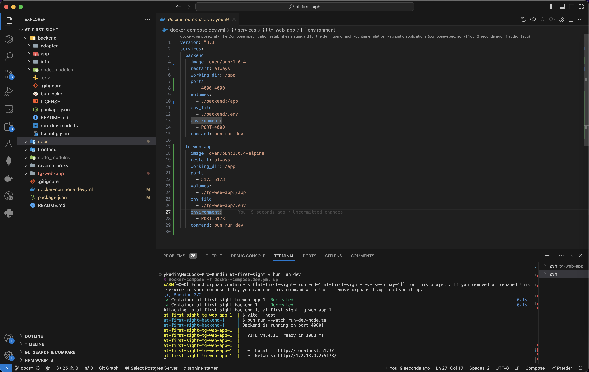

# At first sight! / Preparing the backend for the application



To begin with, let's define what we have to do at this step. To develop the functionality of the application, we need an HTTP Server that can process requests from our application and perform the necessary logic, as well as interact with Telegram.

For these purposes, you can choose the language, tool or framework that allows you to create an HTTP Server and write on it, in my case, my choice was TypeScript + Bun. I will not dwell on how to create a server using them, as this information is well described in the official documentation.

Instead, I will focus on explaining how our server works and the part that is responsible for working with Telegram, for example, to check user authorization or make payments. In addition, you can view absolutely all the code at any time in the repository in the [backend directory](https://github.com/ykundin/at-first-sight/blob/backend).

[Bun Documentation](https://bun.sh)

## Why do we need Docker?



Already now our project consists of two microservices, each of which performs its own specific task:

- `/backend` — HTTP Server for authorization, working with data, payments, etc.
- `/tg-web-app` — Responsible for the entire interface, and later will work with the backend

But very soon we will need at least two more services:

- `/database` — database for storing information about users, payments;
- `/object-storage` — file storage to safely store thousands of photos;

It can be problematic and annoying to run each of these services manually and separately, but then it will all need to be run on the combat server as well. Of course, no one does this manually anymore and there are their own tools for this, and one of the most famous is [Docker] (https://www.docker.com).

[Install Docker](https://docs.docker.com/engine/install)

## Containerization of the application

The process of packaging our services inside Docker is called containerization. Let's do this for the backend and frontend of our application, after which we will be able to run the entire project with one command.

1. **Creating `docker-compose.dev.yml`**

   This file is a configuration for each of the microservices, looking at which you can immediately understand what the whole project consists of.
   Let's start by adding just one service to it.

   ```yml
   version: "3.3"
   services:
     backend:
       image: oven/bun:1.0.3 # We use Bun
       restart: always
       working_dir: /app
       ports:
         - 4000:4000 # Opening the port for access
       volumes:
         - ./backend:/app:ro # All files from the /backend directory belong to this microservice
       env_file:
         - ..env # And this is a file with private variables, for example, a token for Telegram
       environment:
         - PORT=4000 # A microservice will be launched on this port
       command: bun run dev # And this is the command to run
   ```

2. **And now let's add a frontend**

   ```yml
   version: "3.3"
   services:
     backend:
       ...

    tg-web-app:
       image: oven/bun:1.0.4-alpine
       restart: always
       working_dir: /app
       ports:
         - 5173:5173
       volumes:
         - ./tg-web-app:/app
       env_file:
         - .env
       environment:
         - PORT=5173
       command: bun run dev
   ```

   As you can see, the configuration is quite simple and very similar for each of the services, and this is the beauty of Docker.

3. **Update the team to launch the project**

   And now add the `package' file.json` to the root of the repository to add a command to run the entire project with one command.

   ```json
   {
     "name": "@at-first-sight/root",
     "scripts": {
       "dev": "docker-compose -f docker-compose.dev.yml up"
     },
     "type": "module"
   }
   ```

4. **Launch the project in Docker**

   

   Now let's stop the application that was running during the interface development and run the `bun run dev` command in the root of the repository. And Docker will launch two services for us at once — backend and frontend!

<br clear="right"/>

## Adding a database

Already at the next stage of development, we will need a database to store user data, so let's add it to our project right away, while we are not far from Docker.

As a database I will use [MongoDB](https://www.mongodb.com), and to add it again, we will need to edit the `docker-compose.dev.yml` a little:

```yml
version: "3.3"
services:
  ...

  db:
    image: mongo:5.0.2
    restart: always
    env_file:
      - .env
    # Data to connect to the database (can be transferred to the .env file)
    environment:
      - MONGO_INITDB_ROOT_USERNAME=kundin
      - MONGO_INITDB_ROOT_PASSWORD=very-secret-password
      - MONGODB_DATABASE=at-first-sight
    ports:
      - 27017:27017
    volumes:
      - db_data:/data/db
      - ./mongo/docker-entrypoint-initdb.d:/docker-entrypoint-initdb.d:ro

volumes:
  db_data:
```

## Learning how to make backend requests

So, we have both a backend and a frontend service, but it remains to learn how to make requests to our own backend and receive information from it. Let's implement the `getUser` method, which will not return real information yet (we will do this in the next part), and we will call this method when opening the application.

1. **Implementing the request on the backend**

   Everything is quite simple here and, most likely, does not even need comments:

   ```ts
   {
    method: "GET",
    path: "/api/get-user",
    handler() {
      return Promise.resolve({ ok: true, data: null });
    },
   }
   ```

   [View the entire code](https://github.com/ykundin/at-first-sight/blob/docs/backend/adapter/rest-api/auth.ts)

2. **Passing the backend address to the frontend application**

   And here Docker and the file `docker-compose.dev.yml` will help us again:

   ```yml
      version: "3.3"
      services:
        db:
         ...

        backend: # Service name
          ...

        tg-web-app:
          ...
          environment:
            - PORT=5173
            - BACKEND_URL=http://backend:4000 # Adding the backend address in the form of the service name
   ```

3. **Proxying API requests**

   And now we will make sure that absolutely all requests that start with `/api` will be automatically sent to our backend service. This is called query proxying and greatly simplifies integration with the backend. With Vite, this is implemented in just a few lines in the file `/tg-web-app/vite.config.ts`:

   ```ts
   import { defineConfig } from "vite";
   import react from "@vitejs/plugin-react";

   // https://vitejs.dev/config/
   export default defineConfig({
     server: {
       port: Number(process.env.PORT) || 3000,
       proxy: {
         "/api": {
           target: process.env.BACKEND_URL, // The same address that we specified in docker-compose.dev.yml
         },
       },
     },
     plugins: [react()],
   });
   ```

4. **Adding QueryClient**

   Working with requests is that we will need to get the status of the request, the necessary data, cache requests so as not to make the same request again, update the information received after some time, handle errors and much more. And all this functionality has long been implemented in some libraries, for example, in [ReactQuery](https://tanstack.com).

   Let's install it in our frontend application:

   ```bash
   cd tg-web-app
   bun install @tanstack/react-query
   ```

   And we will create a client at the level of the entire application, that is, in the 'App.tsx` file:

   ```tsx
   import { QueryClient, QueryClientProvider } from "@tanstack/react-query";

   function App() {
     const queryClient = new QueryClient();
     const router = createBrowserRouter(...);

     return (
       <QueryClientProvider client={queryClient}>
         <RouterProvider router={router} />
       </QueryClientProvider>
     );
   }

   export default App;
   ```

5. **Getting information about the user**

   And now the last step, where we will write a custom hook `useUser`, which will send a request to the backend and return us information about the current user:

   ```ts
   import { useQuery } from "@tanstack/react-query";

   function useUser() {
     return useQuery({
       queryKey: ["user"],
       queryFn: async () => {
         // And here is the request for our backend
         const res = await fetch("/api/get-user");
         const result = await res.json();

         if (!result.ok) {
           throw new Error(result.error);
         }

         return result.data;
       },
     });
   }

   export default useUser;
   ```

   [View inside component](https://github.com/ykundin/at-first-sight/blob/docs/tg-web-app/src/screens/welcome-screen/elems/start-step/start-step.tsx)

That's it! Now we have absolutely everything necessary to implement registration and authorization of users inside the application.

[Registration and Authorization](./07-auth-reg.md)
