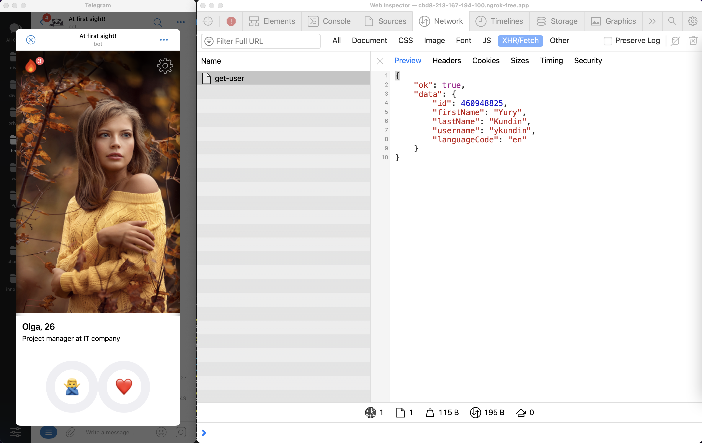
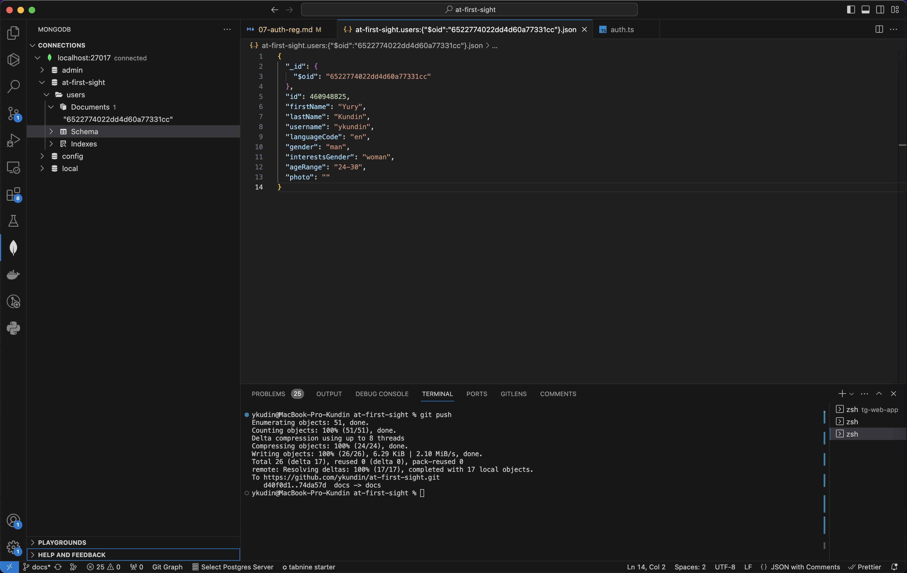
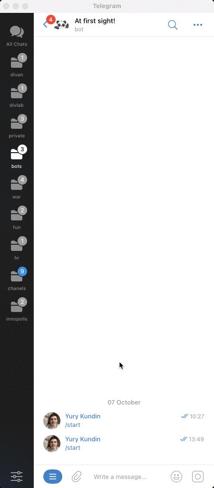

# At first sight! / Registration and authorization

Our task at this step is to implement user registration at the first login to our application, and automatically pass authorization at the second one. I will try to analyze in detail the scheme of work and the opportunities that Telegram provides us, but there will already be noticeably more code, so do not hesitate to look directly into the code (especially on the Auth class).

## Getting user information



In fact, during the opening of the application, Telegram immediately provides us with information about the user. But in order to make sure that this information was not forged, Telegram provides an algorithm for verifying the data — [see the documentation](https://core.telegram.org/bots/webapps#validating-data-received-via-the-mini-app).

1. **Send initData**

   To begin with, let's slightly rewrite the `useUser` hook and transfer all the information that Telegram provides to us to the backend:

   ```tsx
   import { useQuery } from "@tanstack/react-query";

   function useUser() {
     return useQuery({
       queryKey: ["user"],
       queryFn: async () => {
         // eslint-disable-next-line @typescript-eslint/no-explicit-any
         const initData = (window as any).Telegram.WebApp.initData; // Information from Telegram

         // We will send this information to the backend using the POST method and JSON
         const res = await fetch(`/api/get-user`, {
           method: "POST",
           headers: {
             ContentType: "application/json",
           },
           body: JSON.stringify({ initData }),
         });
         const result = await res.json();

         if (!result.ok) {
           throw new Error(result.error);
         }

         return result.data;
       },
     });
   }

   export default useUser;
   ```

2. **Checking the user on the backend**

   And now we are implementing an algorithm to verify the information that we received from the client to make sure that it is really correct and can be trusted:

   ```tsx
   import crypto from "node:crypto";
   import { ValidationError } from "../app/errors/validation-error";

   class Auth {
     getUserByInitData(inputInitData: string): User {
       const initData = new URLSearchParams(inputInitData || "");
       const inputUser = initData.get("user") || "null";
       const inputHash = initData.get("hash") || "";

       // Using a token from BotFather
       const token = process.env.TELEGRAM_BOT_API || "";

       // Preparing parameters
       const inputParams: {
         key: string;
         value: string;
       }[] = [];
       initData.forEach((value, key) => {
         if (key === "hash") return;
         inputParams.push({ key, value });
       });

       const sortedInputParams = inputParams.sort((a, b) => {
         return a.key.localeCompare(b.key);
       });

       const dataCheckString = sortedInputParams
         .map(({ key, value }) => `${key}=${value}`)
         .join("\n");

       // We form a new hash and check that it matches what Telegram gave us
       const secretKey = crypto
         .createHmac("sha256", "WebAppData")
         .update(token);
       const baseHash = crypto
         .createHmac("sha256", secretKey.digest())
         .update(dataCheckString)
         .digest("hex");

       if (baseHash !== inputHash) {
         throw new ValidationError({
           field: "hash",
           message: "Incorrect auth hash",
         });
       }

       try {
         // If everything is fine, then the information can be trusted
         const tgUser = JSON.parse(inputUser);

         return {
           id: tgUser.id,
           firstName: tgUser.first_name,
           lastName: tgUser.last_name,
           username: tgUser.username,
           languageCode: tgUser.language_code,
         };
       } catch (e) {
         throw new ValidationError({
           field: "user",
           message: "Incorrect format of user",
         });
       }
     }
   }
   ```

3. **Working with the token**

   Please note that inside the algorithm we need a secret token that we received from BotFather during the registration of our bot. I highly do not recommend saving this token in the application code, since this token gives full access to your bot and it is not safe.

   Instead, so—called environment variables are used, which are stored in the `.env` file, and then they can be obtained inside the application code using this entry - `process.env.TELEGRAM_BOT_API`, where `TELEGRAM_BOT_API` is the name of the variable and can be anything.

   This file should not be in the Git repository, so make sure that it was added to `.gitignore'. The contents of the sample file:

   ```bash
   TELEGRAM_BOT_API=6406180840:AAFpHAa-a5IMDM25kef2tbScNCX8PjKy2a
   ```

## User Registration

The logic of user registration does not depend on Telegram in any way and may vary depending on the type of application, and some applications do not need it at all. In our application, user registration is required, so I will briefly tell you about the most important thing in this process.

1. **We send a registration request**

   First you need to implement the transfer of all data for registration from the application. In my case, on the first visit to the application, the user has a screen with additional questions. After answering all the questions, we ask the user to select a photo, and then send it to the backend as a POST request to the address `/api/registration'.

   [View code](https://github.com/ykundin/at-first-sight/blob/docs/tg-web-app/src/screens/welcome-screen/elems/messages-step/messages-step.tsx) (look for the `handleSubmit` function)

2. **Writing a request handler**

   And now you need to add a handler on the backend for this request:

   ```tsx
   {
       method: "POST",
       path: "/api/registration",
       async handler({ request }) {
         const auth = new Auth();
         const tgUser = auth.getUserByInitData(request.body.get("initData"));
         const user = await auth.register(request.body, tgUser);

         return {
           ok: true,
           data: user,
         };
       },
     },
   ```

3. **We implement registration**

   As you can see, the request handler only serves to call the desired method in the `Auth` class, passing information from the request to it. Let's take a closer look at this class and the `register` method:

   ```tsx
   import crypto from "node:crypto";
   import { MongoClient } from "mongodb";

   import { ValidationError } from "../app/errors/validation-error";

   import type { Collection, Db } from "mongodb";

   class Auth {
     #cookieName = "session_id";

     #client: MongoClient;
     #db: Db;
     #users: Collection<User>;

     constructor() {
       this.#client = new MongoClient(process.env.MONGO_URI || "");
       this.#db = this.#client.db(process.env.MONGO_DB || "");
       this.#users = this.#db.collection("users");
     }

     async saveUser(user: User): Promise<boolean> {
       const result = await this.#users.insertOne(user);

       return result.acknowledged;
     }

     async getUserById(userId: User["id"]): Promise<User | null> {
       const user = await this.#users.findOne({ id: userId });

       return user;
     }

     async register(form: FormData, tgUser: TelegramUser): Promise<User> {
       // TODO: Add the validation of form data

       // Maybe user already exists?
       const dbUser = await this.getUserById(tgUser.id);
       if (dbUser) {
         return dbUser;
       }

       const user = {
         ...tgUser,
         gender: String(form.get("gender")) || "",
         interestsGender: String(form.get("interests")) || "",
         ageRange: String(form.get("age-range")) || "",

         // TODO: Upload photo to Object Store
         photo: "",
       };

       await this.saveUser(user);

       return user;
     }
   }

   export default Auth;
   ```

   As you can see, at this stage I completely missed the stage with the validation of the received data, and also did not implement the logic with saving the user's photo. But, of course, this must be done before your application gets into production. We'll get to that later.

   [Open File](https://github.com/ykundin/at-first-sight/blob/docs/backend/app/auth.ts)

4. **Interaction with the database**

   

   And also pay attention to the constructor inside the `Auth` class — here we create a connection to the database, and we take all the necessary data for this from the environment variables. So it's time to edit the `.env` file:

   ```bash
   TELEGRAM_BOT_API=6406180840:AAFpHAa-a5IMDM25kef2tbScNCX8PjKy2a
   MONGO_URI=mongodb://kundin:very-secret-password@db:27017/?authSource=admin&readPreference=primary&ssl=false&directConnection=true
   MONGO_DB=at-first-sight
   ```

   We have already specified all the necessary parameters for the database in the `docker-compose.dev.yml` file. Please note that to apply the new environment variables, you need to completely restart the application in Docker. And in order to conveniently view what was eventually saved to the database, I recommend installing [extension for VS Code] (https://github.com/mongodb-js/vscode).

## User authorization



There will be quite a lot of API methods in our application that should be available only to authorized users, but checking each user via Telegram's `initData` is inconvenient and leads to this part of the code being repeated from time to time.

Therefore, let's write a simple user authorization using a cookie, in which we will store the session ID. If a user comes to us with a `cookie`, then we will try to get all the necessary information about him by ID, instead of `initData`. This example intentionally shows the simplest authorization logic without using frameworks and ready-made solutions to explain how they work.

1. **Adding code to work with the session**

   Let's start by adding two methods to the `Auth` class to create a session and to get user information from a session (a session is a regular collection in a database):

   ```tsx
   import { nanoid } from "nanoid";
   import { MongoClient } from "mongodb";
   import { ValidationError } from "../app/errors/validation-error";
   import type { Collection, Db } from "mongodb";
   import type { User } from "../domain/user";

   interface Session {
     id: string;
     userId: User["id"];
   }

   class Auth {
     #cookieName = "session_id";
     ...
     #sessions: Collection<Session>;

     constructor() {
       ...
       this.#sessions = this.#db.collection("sessions");
     }

     get cookieName(): string {
       return this.#cookieName;
     }

     async getUserById(userId: User["id"]): Promise<User | null> {
       ...
     }

     async createSession(userId: User["id"]): Promise<string | null> {
       const sessionId = nanoid();
       const result = await this.#sessions.insertOne({
         id: sessionId,
         userId: userId,
       });

       return result.acknowledged ? sessionId : null;
     }

     async getUserFromSession(sessionId: string): Promise<User | null> {
       const session = await this.#sessions.findOne({ id: sessionId });
       const user = session ? await this.getUserById(session.userId) : null;

       return user;
     }
   }
   ```

   Note that the session ID is always unique, so I use a small `nanoid` library for this task, don't forget to install it in the `backend` service: `bun install nanoid`;

2. **We save the session after registration**

   And now we will slightly edit the registration handler code so that after successful registration we add a `cookie` with the session ID to the user. It is this identifier that will allow us to understand that the user is already authorized when he performs other requests.

   ```tsx
   // file /backend/adapter/rest-api/auth.ts
   {
    method: "POST",
    path: "/api/registration",
    async handler({ request, response }) {
      const auth = new Auth();
      const tgUser = auth.getUserByInitData(request.body.get("initData"));
      const user = await auth.register(request.body, tgUser);
      const sessionId = await auth.createSession(user.id);

      if (user) {
        const sessionId = await auth.createSession(user.id);

        // Save the sessionId in cookie
        if (sessionId) {
          response.setCookie(auth.cookieName, sessionId, {
            secure: true,
            httpOnly: true,
          });
        }
      }

      return {
        ok: true,
        data: user,
      };
    },
   },
   ```

3. **Adding a user to each handler**

   And now we will do what everything was intended for — information about the user will be available in each request handler and we can immediately use it to write the necessary logic. To do this, it will try to get the user from the `cookie` before starting the handler:

   ```tsx
   // file /backend/infra/bun-http-server.ts

   // Try to find user by sessionId in cookies
   const cookies = cookie.parse(req.headers.get("Cookie") || "");
   const sessionId = cookies[this.#auth.cookieName];
   const user = await this.#auth.getUserFromSession(sessionId);

   ...
   // Add the user to every request handler
    const result = await route.handler({ request, response, user });
   ```

4. **What has changed?**

   Now if we want to make a request handler that is only available to authorized users, then the code will become much easier to understand and write, for example:

   ```tsx
   {
    method: "POST",
    path: "/api/unlock-profile",
    before: [shouldBeAuth],
    async handler({ request, user }) {
      if (!user) {
        throw new Error('User not authorized!');
      }

      return ...
    },
   }
   ```

You will see even more examples of this approach in the next stages of development and will quickly understand the advantages. Of course, this is one of the simplest authorization mechanisms, which may have some security problems, but it perfectly describes the general principle of authorization using cookies.

And now it's time for you and me to sort out the most intriguing topic — working with payments!

[Payments inside Telegram Web App](./08-payments.md)
