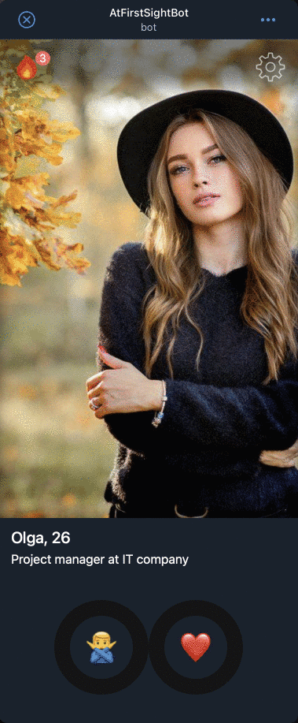

# At first sight! / Payments inside Telegram Web App



Telegram provides your application with the ability to make payments directly inside the application, which opens up a huge scope for the possibilities of monetization of applications and the provision of paid services.

For example, each user has a daily limit on viewing other people's profiles, which is updated daily. But we also give the user the opportunity to increase the limit by paying for a virtual product directly through Telegram.

Let's look at the main stages of working with payments in this example.

## 1. Connecting the provider

Telegram provides access to many payment providers, the list of which is also constantly updated. And first of all, you need to connect one or more payment providers inside your bot settings (use @BotFather).

Each provider may have its own conditions for making payments and this is beyond the scope of the instructions, but also each provider provides a test mode that is convenient during development and testing (I will use the provider YOOKASSA).

## 2. Get a provider token

After connecting, each provider provides a certain unique token, which must be put in `.env`.
We will use it during the creation of payments:

```bash
TELEGRAM_YOOKASSA_TOKEN=381764678:TEST:68550 # Payment provider token from @BotFather
```

## 3. Creating a payment

The logic of the application and the options for paid services can be completely different, but it all starts with the fact that we create a new payment using the Telegram Bot API on our own backend:

```ts
class Payments {
  createInvoiceLink(order: Order): Promise<string> {
    const link = this.#botApi.query<string>("createInvoiceLink", {
      title: "Buy 100 scores",
      description: "You will get another 100 points to evaluate other people",
      currency: "RUB",
      prices: [
        {
          label: "Price",
          amount: 100 * 100,
        },
      ],
      // Any additional information at your discretion
      payload: JSON.stringify({
        paymentId: "test",
        currentUserId: params.currentUserId,
        scores: 100,
      }),
      provider_token: process.env.TELEGRAM_YOOKASSA_TOKEN,
    });

    return link;
  }
}
```

If everything was successful, then in response to this request, Telegram will return us a payment link that needs to be opened inside the Web App using
the [openInvoice](https://core.telegram.org/bots/webapps#initializing-mini-apps) method:

```ts
const res = await fetch("/api/buy-scores", ...);
const result = await res.json();

if (!result.ok) {
    alert("Unknown error, try again");
    return;
}

// result.data its a payment link from Telegram
webApp.openInvoice(result.data, (status: string) => {
    if (status === "paid") {
        console.log('Success payment!');
    }
});
```

Immediately after that, the user will have a window open inside the application with all the information about your service and the ability to pay for it using the provider you selected in the first step.

## 4. Getting Payment Information

But after the user enters all the necessary data and clicks on the payment, our backend needs to somehow get information that such a payment has been made, check it and provide the service to the user (in our case, remove the restriction).

- **Setting up a webhook**
  In order to be able to receive all the necessary information from Telegram, we must tell him the URL of the backend to which he can send it. It usually looks something like this:

  ```ts
  async setWebhook() {
  const url = process.env.PUBLIC_URL || "";

  return this.query("setWebhook", { url: `${url}/webhook` });
  }
  ```

- **Checking the payment**
  If everything is done correctly, then now to the address `/webhook` we will receive information about payments:

  ```ts
    {
      method: "POST",
      path: "/webhook",
      async handler({ request }) {
        const botApi = new TgBotApi();

        // TODO: Check the payment!
        if (request.body.pre_checkout_query) {
          await botApi.query("answerPreCheckoutQuery", {
            ok: true,
            pre_checkout_query_id: request.body.pre_checkout_query.id,
          });
        }

        // Info about success payment
        if (request.body.message?.successful_payment) {
          const payment = request.body.message.successful_payment;
          const payload = JSON.parse(payment.invoice_payload);

          console.log("New payment", payment);
        }

        return { ok: true };
      },
    },
  ```

In fact, this is just one of the simplest payment options, which shows only the general scheme of work and needs to be finalized before you start using it in real payments. You can find more detailed information about payments in the official Telegram documentation — [Payments API](https://core.telegram.org/bots/payments)
