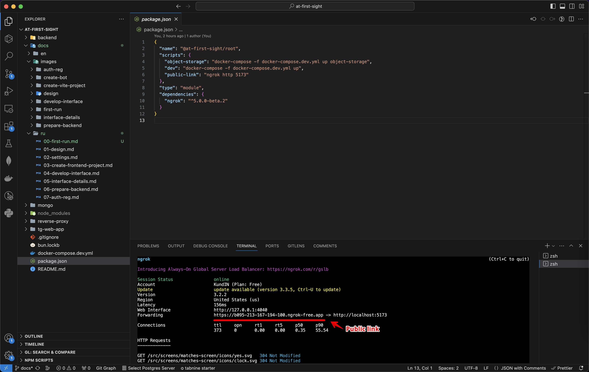

# С первого взгляда! / Первый запуск

Данный репозиторий имеет код для клиента и сервера, но также и несколько инфраструктурных сервисов, таких как база данных MongoDB, объектное хранилище Minio и сервер для проксирования изображений из данного хранилища. Весь набор сервисов запускается одной командой с помощью Docker, но перед этим необходимо создать необходимые файлы конфигурации (как правило, это делается только один раз).

## Установка Docker

Так как для разворачивания микросервисов используется Docker, то в первую очередь его необходимо установить на компьютер. Docker доступен для Windows, Linux и MacOS, а подробная инструкция по установке находится на официально сайте.

[Инструкция по установке](https://docs.docker.com/engine/install/)

## 1. Получаем публичную ссылку на приложение



Для того чтобы запустить приложение внутри Telegram, потребуется публичная ссылка на данное приложение. В продакшн-режиме этой ссылкой является ваш домен, а локально мы будем использовать Ngrok. Выполните следующие команды в своём терминале:

```bash
npm i
npm run public-link
```

Не закрывайте данный терминал, иначе ссылка перестанет работать. Вместо этого откройте новую вкладку в терминале и продолжайте там.

## 2. Получение доступов к файловому хранилищу

Приложение использует Minio для хранения фотографий пользователей, но при первом запуске нам необходимо получить данные для доступа к нему.

```bash
npm run object-storage
```

Затем откройте страницу [http://localhost:9001](http://localhost:9001) и авторизуйтесь, используя логин `kundin` и пароль `very-secret-password` (настраивается в `docker-compose.dev.yml`).

- Создайте ключ доступа (Access Keys => Create access key) и сохраните, они потребуются позже;
- Создайте новый бакет для хранения файлов (Object Browser => Create a Bucket), назовите его `at-first-sight`;
- Готово, нажмите `Ctrl + C` в терминале, чтобы остановить приложение.

## 3. Создайте файл с доступами

А теперь создайте файл `.env`, который будет хранить в себе абсолютно все необходимые доступы для приложения, например:

```bash
PUBLIC_URL=https://b095-213-167-194-100.ngrok-free.app # Public url from first step

# Telegram
TELEGRAM_BOT_API=6406180840:AAFpHYAa-V5IMDM67kef2tbScxCX8PpKyjA # Token for your bot from @BotFather
TELEGRAM_YOOKASSA_TOKEN=381764678:TEST:68380 # Payment provider token from @BotFather

# Mongo DB
MONGO_INITDB_ROOT_USERNAME=kundin
MONGO_INITDB_ROOT_PASSWORD=very-secret-password
MONGODB_DATABASE=at-first-sight
MONGO_URI=mongodb://kundin:very-secret-password@db:27017/?authSource=admin&readPreference=primary&ssl=false&directConnection=true
MONGO_DB=at-first-sight

# Object storage data from second step
AWS_BUCKET=at-first-sight
AWS_ACCESS_KEY_ID=nZmM2Np3dfaX8wglU1Py
AWS_SECRET_ACCESS_KEY=L9VvkRFiW0b5Ak4Q2KbIbYNVYLPsd5KssWn1l3rK
```

## 4. Запускайте уже!

Добавьте публичную ссылку в настройках вашего бота, после чего вы уже можете открыть своего бота и запустить Web App.

Обратите внимание, что всё приложение будет запущено в режиме разработки, поэтому если отредактировать код клиентской или серверной части проекта, то изменения применятся практически мгновенно.

GL HF! ;)
