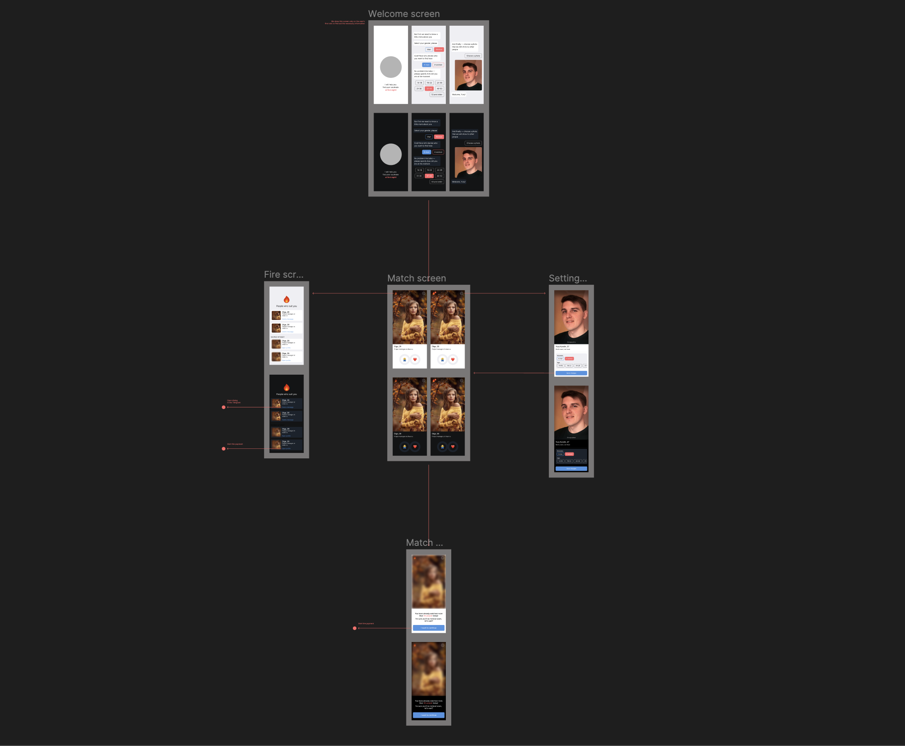
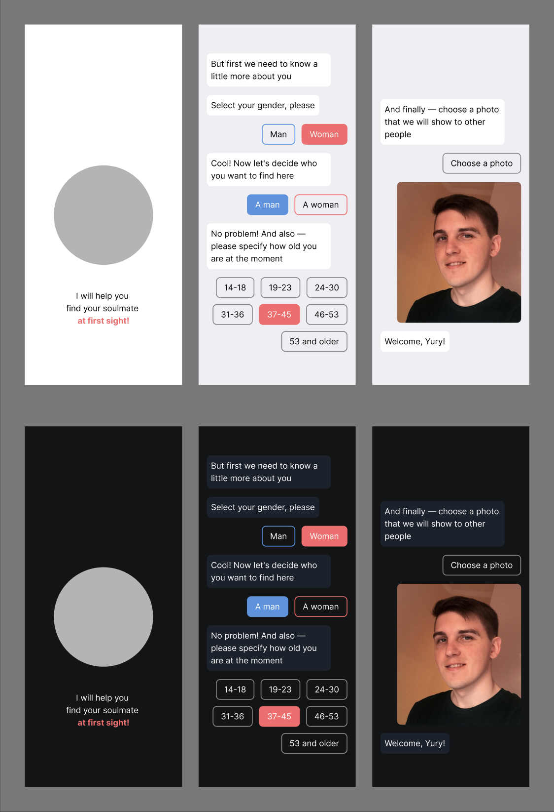

# С первого взгляда! / Дизайн

На данном этапе необходимо продумать прототип приложения и его первую минимально возможную версию, которая будет нести ценность для пользователя.
Ни в коем случае не рекомендую сразу приступать к разработке, надеясь на то, что решения будут приняты на ходу. Как правило, продумывание дизайна приложения
позволяет заметно сократить время разработки, сразу выявить узкие места или заложить определенную архитектуру.

### Минимальная функциональность

1. Пользователь может создать свой профиль, который будет использоваться для показа другим пользователям в целях знакомства;
2. Пользователь может редактировать свой профиль в любое время без ограничений;
3. Пользователь может оценивать другие профили в формате "Понравился" / "Не понравился";
4. Если мнения двух пользователей совпали друг о друге, то оба получают уведомление и отображаются в отдельном списке;
5. Пользователь может начать диалог с людьми, если их мнения совпали;
6. Пользователь видит профили тех, кто оценил его положительно, но это ещё не взаимно. Такой профиль закрыт и чтобы его открыть возможны два варианта действий: а) выполнить платеж, б) случайно наткнуться на него и взаимно оценить;
7. Если пользователь оценил более 50-ти людей за сутки, то доступ к оценке временно блокируется, но ограничение можно снять, выполнив платеж.

### Дизайн

Теперь необходимо спроектировать интерфейс в виде нескольких экранов, которые позволят нам реализовать данную функциональность и продумать навигацию внутри приложения. Как правило, в современной разработке чаще всего для этого используют Figma — инструмент, который знаком каждому дизайну, но который достаточно прост даже для тех людей, кто откроет его впервые.

Figma бесплатная и доступна в онлайн-формате, поэтому посмотреть результат вы можете прямо по ссылке.

[Открыть макет](https://www.figma.com/file/Zg8AVusk4C620Vsvy7uiyu/At-first-sight!?type=design&node-id=0%3A1&mode=design&t=qsCjvDPdpzYcKCqL-1)

### Экраны приложения

Всё приложение на данный момент состоит из 4-х экранов, каждый из которых выполняет определенную задачу и между которыми пользователь может перемещаться.
Давайте подробно рассмотрим каждый из них.

##### Знакомство

Данный экран показывается пользователю только при первом использовании приложения и служит формой регистрации профиля. На этом экране в формате диалога с пользователем мы выясняем его интересы, возраст и позволяем загрузить собственную фотографию. После чего, пользователь сохраняется в нашей базе данных и больше никогда не попадает на данный экран заново.

### Содержание

- Дизайн / [in English](../en/01-design.md) / [на русском языке](./01-design.md)
- Разработка интерфейса / [in English](../en/02-interface.md) / [на русском языке](./02-interface.md)
