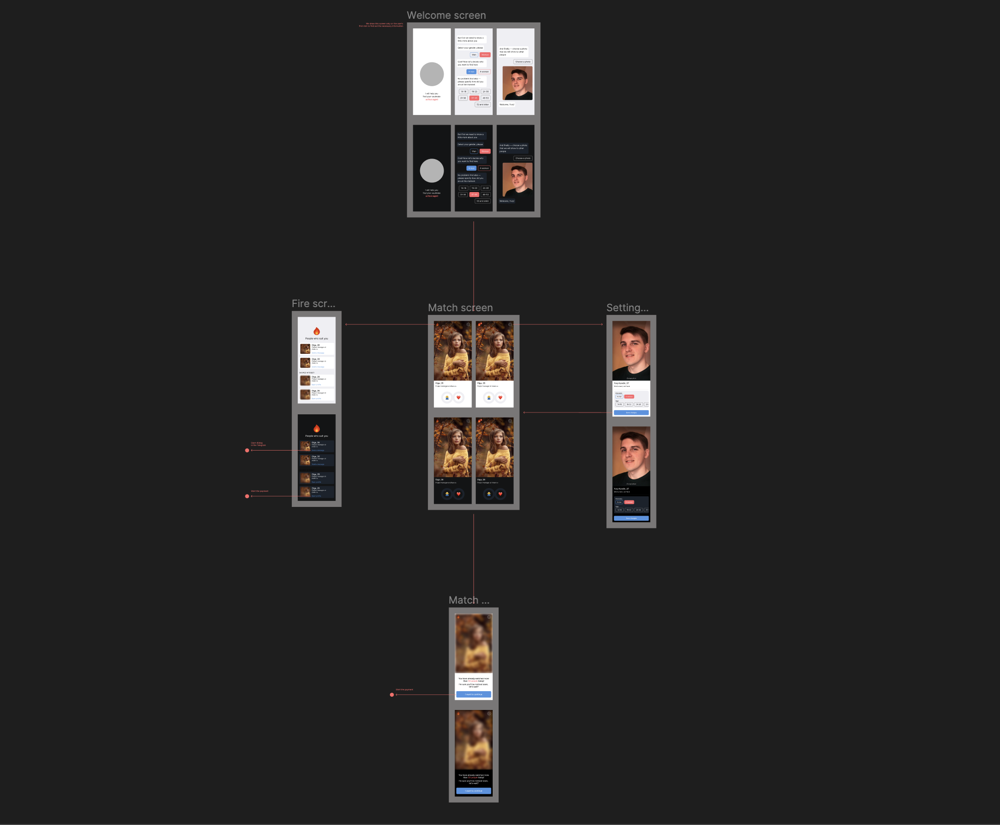
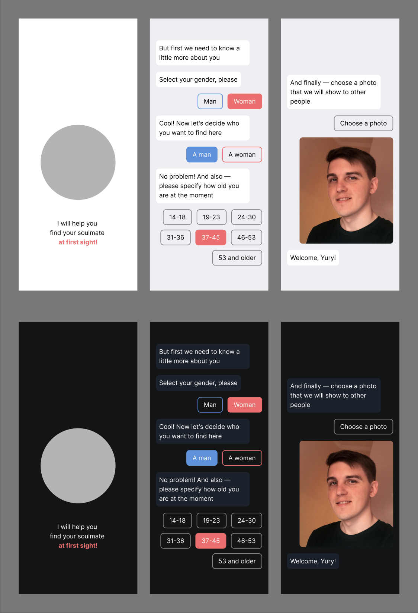
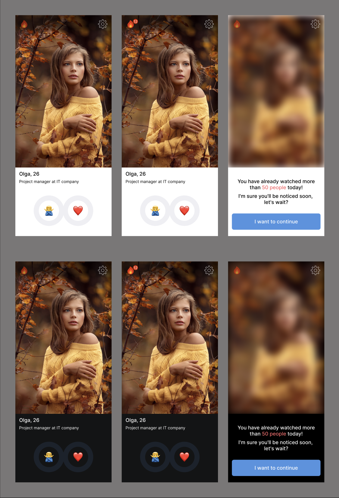
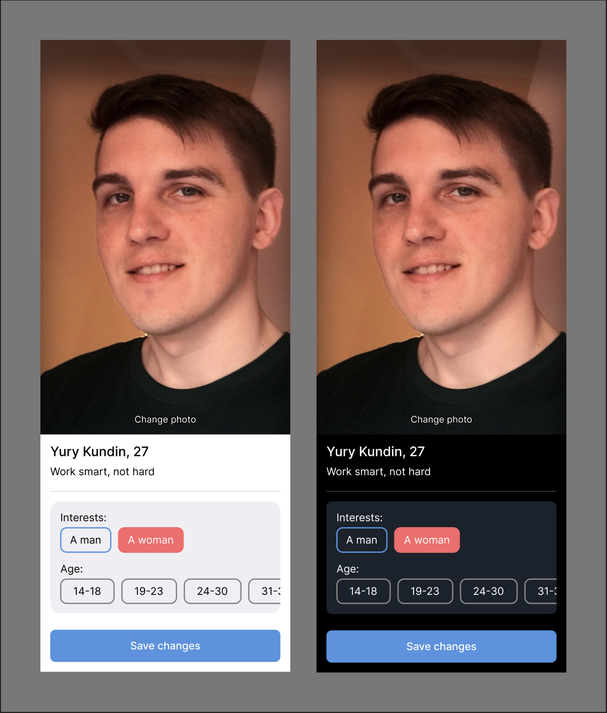
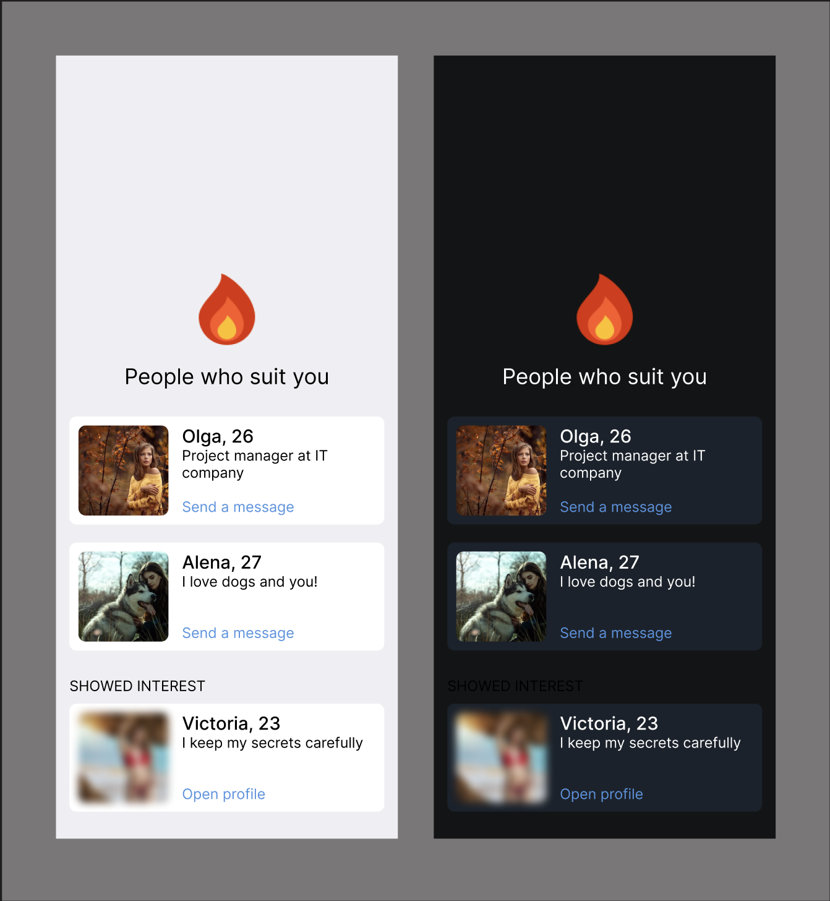

# С первого взгляда! / Дизайн

На данном этапе необходимо продумать прототип приложения и его первую минимально возможную версию, которая будет нести ценность для пользователя.
Ни в коем случае не рекомендую сразу приступать к разработке, надеясь на то, что решения будут приняты на ходу. Как правило, продумывание дизайна приложения
позволяет заметно сократить время разработки, сразу выявить узкие места или заложить определенную архитектуру.

### Минимальная функциональность

1. Пользователь может создать свой профиль, который будет использоваться для показа другим пользователям в целях знакомства;
2. Пользователь может редактировать свой профиль в любое время без ограничений;
3. Пользователь может оценивать другие профили в формате "Понравился" / "Не понравился";
4. Если мнения двух пользователей совпали друг о друге, то оба получают уведомление и отображаются в отдельном списке;
5. Пользователь может начать диалог с людьми, если их мнения совпали;
6. Пользователь видит профили тех, кто оценил его положительно, но это ещё не взаимно. Такой профиль закрыт и чтобы его открыть возможны два варианта действий: а) выполнить платеж, б) случайно наткнуться на него и взаимно оценить;
7. Если пользователь оценил более 50-ти людей за сутки, то доступ к оценке временно блокируется, но ограничение можно снять, выполнив платеж.

### Дизайн

Теперь необходимо спроектировать интерфейс в виде нескольких экранов, которые позволят нам реализовать данную функциональность и продумать навигацию внутри приложения. Как правило, в современной разработке чаще всего для этого используют Figma — инструмент, знакомый каждому дизайну, но который достаточно прост даже для тех людей, кто откроет его впервые.

Figma бесплатная и доступна в онлайн-формате, поэтому посмотреть результат вы можете прямо по ссылке.

[Открыть макет](https://www.figma.com/file/Zg8AVusk4C620Vsvy7uiyu/At-first-sight!?type=design&node-id=0%3A1&mode=design&t=qsCjvDPdpzYcKCqL-1)

### Экраны приложения

Всё приложение на данный момент состоит из 4-х экранов, выполняющих определенную задачу, между которыми пользователь может перемещаться.
Давайте подробно рассмотрим каждый из них.

#### Знакомство

Данный экран показывается пользователю только при первом использовании приложения и служит формой регистрации профиля. На этом экране в формате диалога с пользователем мы выясняем его интересы, возраст и позволяем загрузить собственную фотографию.

После чего, пользователь сохраняется в нашей базе данных и больше никогда не попадает на данный экран заново. Список вопросов может изменяться со временем и подбираться таким образом, чтобы максимально точно реализовать поиск подбора интересных пользователю людей. Всё это может быть как одно из дальнейших направлений развития приложения, но не будет обсуждаться в рамках данного репозитория.

После окончания процесса регистрации пользователь попадает на следующий экран, который является основным.

 

#### Поиск интересных людей

Именно на этом экране пользователь будет проводить больше всего времени в приложения, оценивая других людей, которые были подобраны под его интересы.
Несколько важных моментов:

- Сверху есть уведомления в виде огонечка и иконка в виде шестеренки, что служит переходом на другие экраны;
- Пользователь может оценить не более 50-ти людей в сутки, чтобы избежать спама, накрутки и побудить пользователя более внимательно относиться к выборам;
- Если лимит исчерпан, то просматривать других людей нельзя. Но пользователь может снять ограничение, произведя платеж внутри приложения;

Надеюсь, что на этом экране вы также уже поняли, что в первой версии приложения сразу будет как тёмная, так и светлая тема? Telegram Web App позволяет автоматически подстроить отображение под ту тему, которую выбрана у пользователя на телефоне и это также стоит сразу закладывать в дизайн!

 

#### Настройки

Далее нам необходимо продумать и то, что со временем интересы пользователя могут поменяться, либо он захочет изменить фотографию. И для этой цели у нас есть отдельный экран с настройками, который доступен по клику на шестеренку.

Из интересного — кнопка для сохранения изменений будет реализована в виде [MainButton](https://core.telegram.org/bots/webapps#mainbutton), которую предоставляем сам Telegram, поэтому внешний вид будет слегка отличаться. По клику на неё пользователь может сохранить изменения и сразу вернётся на основной экран приложения.

 

#### Просмотр совпадений

И, наконец, самый интригующий экран приложения, который зажигает пламя в сердце! На него можно попасть только при наличии хотя бы одного совпадения интересов и с такими людьми сразу можно начать диалог в Telegram. Но если к вам проявили симпатию, а вы ещё не встретили такого человека на экране с поиском, то приложение покажет его в списке. Правда фотографию пользователю и возможность ему написать можно получить только после проведения платежа.

На этом с дизайном первой версии покончено и можно приступать к проработке данных интерфейсов с технической стороны. Для начала давайте начнём с подготовки проекта для дальнейшей работы, данный процесс описан на отдельной странице.

[Настройка проекта](./02-settings.md)
