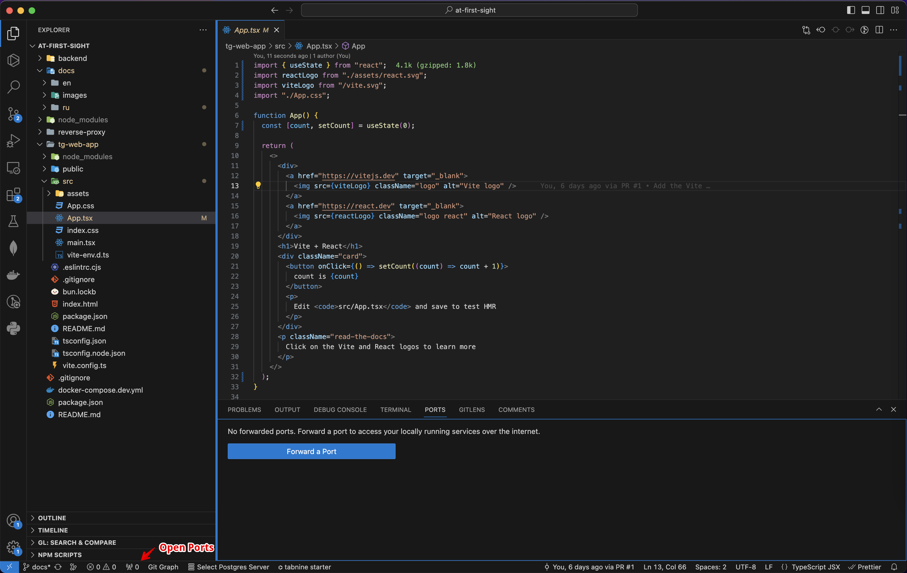

# С первого взгляда! / Создаём проект

На данном этапе наша с вами задача создать шаблон проекта и запустить его прямо внутри Telegram в виде приложения. Мы считаем, что наше приложение будет активно развиваться и дорабатываться, поэтому сразу выберем хорошее и проверенное решение для фронтенда в виде [Vite](https://vitejs.dev/) и [React](https://react.dev/).

1. **Создаём проект Vite + React**

   Для этого из терминала необходимо выполнить следующую команду

   ```bash
   bun create vite tg-web-app
   ```

   В ответ нам будет предложено выбрать несколько опций из списка, предлагаю выбирать следующее — `React`, `TypeScript` (с помощью стрелок на клавиатуре и нажатия на Enter)

2. **Запускам проект**

   

   После того, как проект будет создан нам предложат выполнить следующий набор команд, которые нужно выполнить в терминале поочередно.

   ```bash
   cd tg-web-app # переходим в директорию с проектом
   bun install # устанавливаем зависимости
   bun run dev # запускам проект в режиме разработки
   ```

   В результате вы увидите соообщение о том, что проект успешно запущен по адресу [http://localhost:5173/](http://localhost:5173/) и его уже можно открыть в браузере.
   Если данный порт был занят другой программой, то Vite автоматически найдёт ближайший свободный порт и запустит на нём.

3. **Публичный доступ к проекту**

   

   На данный момент наш проект можно открыть только с нашего компьютера на `localhost`, но чтобы открыть его внутри Telegram потребуется публичный доступ к проекту по HTTPS. Когда стадия разработки будет завершена, то мы выложим проект на наш домен и сервер и это не будет проблемой. Но что же делать в режиме разработки? Предлагаю два варианта:

   **Встроенная возможность VSCode**  
   Не так давно внутри VSCode появилась возможность получать публичную ссылку на любой порт, который нам нужен.
   Для этого нам необходимо открыть панель Ports, нажать на `Forward a Port` и указать тот порт, на котором запущен наш проект (в нашем случае 5173). После небольшого ожидания VSCode сгенерирует нам уникальную публичную ссылку, по которой наш проект будет доступен любого пользователю в интернете.

   Причём нам всё также удобно разрабатывать проект, так как любые изменения кода внутри компонентов будут практически мгновенно отображаться на странице. Единственный минус данного способа — при переходе на данную страницу необходимо авторизоваться с помощью Github.
