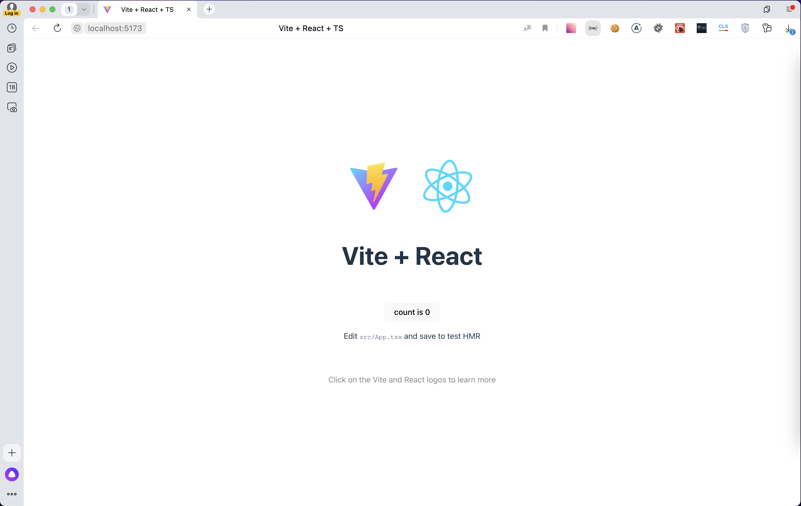
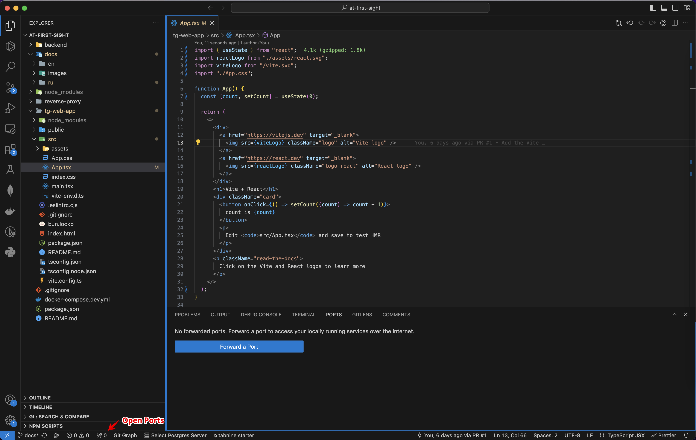
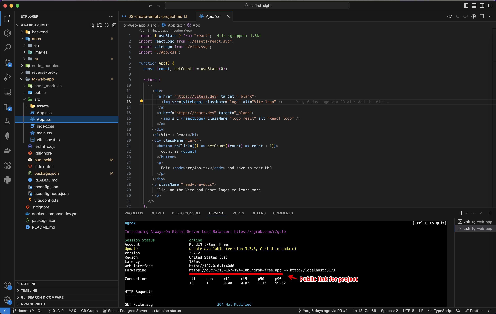
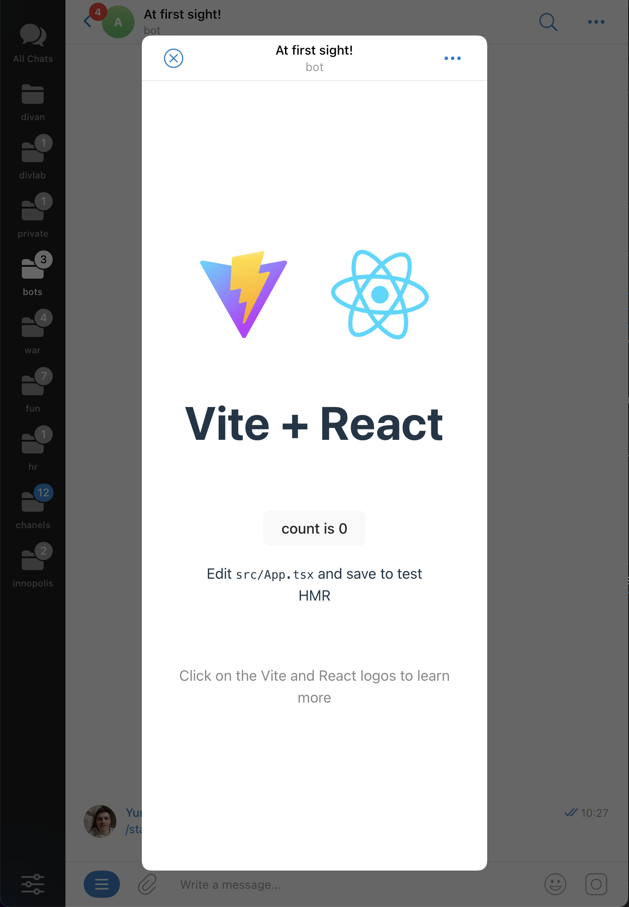

# С первого взгляда! / Создаём проект для фронтенда

На данном этапе наша с вами задача создать шаблон проекта и запустить его прямо внутри Telegram в виде приложения. Мы считаем, что наше приложение будет активно развиваться и дорабатываться, поэтому сразу выберем хорошее и проверенное решение для фронтенда в виде [Vite](https://vitejs.dev/) и [React](https://react.dev/).

## Создаём проект Vite + React

Для этого из терминала необходимо выполнить следующую команду

```bash
bun create vite tg-web-app
```

В ответ нам будет предложено выбрать несколько опций из списка, предлагаю выбирать следующее — `React`, `TypeScript` (с помощью стрелок на клавиатуре и нажатия на Enter)

## Запускам проект



После того как проект будет создан нам предложат выполнить следующий набор команд, которые нужно выполнить в терминале поочередно.

```bash
cd tg-web-app # переходим в директорию с проектом
bun install # устанавливаем зависимости
bun run dev # запускам проект в режиме разработки
```

В результате вы увидите сообщение о том, что проект успешно запущен по адресу [http://localhost:5173/](http://localhost:5173/) и его уже можно открыть в браузере.

Если данный порт был занят другой программой, то Vite автоматически найдёт ближайший свободный порт и запустит на нём.

## Публичный доступ к проекту

На данный момент наш проект можно открыть только с нашего компьютера на `localhost`, но чтобы открыть его внутри Telegram, потребуется публичный доступ к проекту по HTTPS. Когда стадия разработки будет завершена, то мы выложим проект на наш домен и сервер и это не будет проблемой. Но что же делать в режиме разработки? Предлагаю два варианта:

#### Встроенная возможность VSCode



Не так давно внутри VSCode появилась возможность получать публичную ссылку на любой порт, который нам нужен.
Для этого нам необходимо открыть панель Ports, нажать на `Forward a Port` и указать тот порт, на котором запущен наш проект (в нашем случае 5173). После небольшого ожидания VSCode сгенерирует нам уникальную публичную ссылку, по которой наш проект будет доступен любого пользователю в интернете.

Причём нам всё также удобно разрабатывать проект, так как любые изменения кода внутри компонентов будут практически мгновенно отображаться на странице. Единственный минус данного способа — при переходе на данную страницу необходимо авторизоваться с помощью Github.

#### Используем Ngrok



Если вы используете другой редактор кода или по каким-то другим причинам вам не подходит первый способ, то есть и другие решения для данной задачи, например, [Ngrok](https://ngrok.com/).

1.  Устанавливаем нужные зависимости
    ```bash
    bun add -D ngrok
    ```
2.  Обновляем скрипт для запуска проекта

    ```bash
    # file tg-web-app/package.json

    "scripts": {
        ...
        "public-link": "ngrok http 5173",
        ...
    }
    ```

3.  Перезапускаем проект

    ```bash
    bun run dev
    bun run public-link # в отдельном окне терминале
    ```

    Теперь наш проект всё также будет запущен по адресу http://localhost:5173, но дополнительно Ngrok создаст публичный адрес для нашего проекта и покажет всю необходимую информацию в терминале.

    Обратите внимание, что теперь команды нужно выполнять в отдельных окнах терминала и при каждом перезапуске будет генерироваться новая уникальная ссылка. Чуть позже мы сделаем более удобный запуск проекта.

## Открываем проект внутри Telegram



Мы готовы к тому, что начать интеграцию проекта в Telegram и открывать наше приложение уже внутри созданного собственного бота по кнопке. Это можно реализовать без написания кода с помощью уже известного нам [@BotFather](https://t.me/BotFather)

1. Отправляем команду `/mybots`
2. Выбираем нужного бота из списка (в моём случае это `@at_first_sight_bot`)
3. Далее пункт `Bot Settings`
4. Затем `Menu Button`
5. После чего `Configure menu button`
6. Наконец нас попросят ввести публичный адрес проекта, который мы получали с помощью VSCode или Ngrok на предыдущем шаге.
   Я указываю `https://cbd8-213-167-194-100.ngrok-free.app`, у вас будет другой
7. Далее вводим название кнопки, например "Познакомиться"
8. Всё! Переходим в своего бота и открываем приложение.

<br clear="right"/>

## Инициализация Mini App

Единственное, что осталось сделать, так это добавить в проект JS-скрипт от Telegram, чтобы получить доступ ко всем возможностям, которые описаны в [документации Telegram Mini Apps](https://core.telegram.org/bots/webapps#initializing-mini-apps). Делается это достаточно просто, достаточно вставить скрипт в файл `index.html`

```html
<!DOCTYPE html>
<html lang="en">
  <head>
    <meta charset="UTF-8" />
    <meta name="viewport" content="width=device-width, initial-scale=1.0" />
    <script src="https://telegram.org/js/telegram-web-app.js"></script>
    <title>At first sight!</title>
  </head>

  <body>
    <div id="root"></div>
    <script type="module" src="/src/main.tsx"></script>
  </body>
</html>
```

После выполнения данных настроек мы можем вносить изменения в код проекта и они сразу же будут отображены внутри Telegram Web App даже без перезагрузки приложения. Этого достаточно, что отвлечься от настроек и наконец-то приступить к реализации нашей идеи!

[Разрабатываем интерфейс приложения](./04-develop-interface.md)
