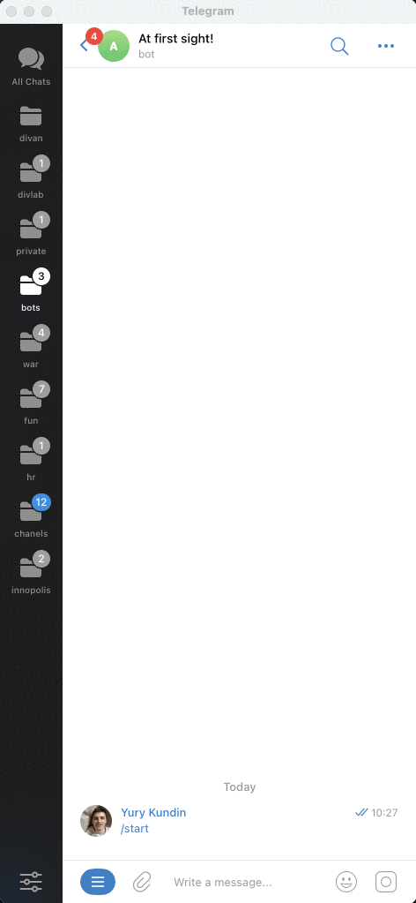
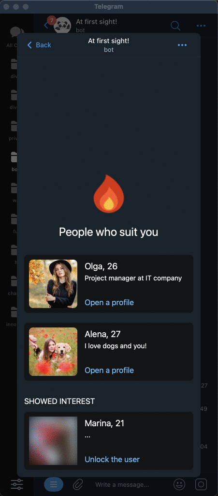

# С первого взгляда! / Разрабатываем интерфейс

Это довольно большой этап разработки, в рамках которого нам с вами необходимо разработать весь интерфейс приложения и те экраны, которые были созданы на этапе дизайна приложения. Предполагается, что вы довольно хорошо знаете TypeScript и React, потому что мы не будем детально разбирать каждый из компонентов интерфейса (но вы всегда можете посмотреть финальный результат прямо в этом репозитории).

Зато мы детально разберём много интерфейсных возможностей, которые предоставляет нам Telegram:

- Работа с двумя темами — светлой и тёмной;
- Отображение основной кнопки приложения;
- Как открывать нативные попапы внутри приложения;
- Использование тактильного отклика в интерфейсе;
- Навигация между экранами приложения с помощью кнопки "Назад".

## Основная навигация

Одна из ключевых механик, которая встречается в большинстве приложений и вебсайтов, позволяющая создавать много страниц/экранов и переходить между ними. Для этой цели я буду использовать проверенную и очень известную библиотеку — [React Router](https://reactrouter.com/en/main/start/tutorial#setup).

1. **Устанавливаем библиотеку**
   ```bash
   # внутри tg-web-app
   bun install react-router-dom
   ```
2. **Создаём пустые экраны приложения**

   Создадим внутри приложения директорию `screens`, которая будет содержать каждый экран приложения:

   - `welcome-screen` — знакомство и регистрация пользователя;
   - `matches-screen` — поиск интересных людей;
   - `settings-screen` — экран с настройками, редактированием профиля;
   - `fire-screen` — просмотр совпадений;

     [Посмотреть код](https://github.com/ykundin/at-first-sight/tree/docs/tg-web-app/src/screens)

3. **Добавляем роутинг внутрь приложения**

   Для этого удаляем всю шаблонную информацию из файла `./src/App.tsx` и добавляем правила роутинга, которые привязывают экран приложения к нужному адресу (адрес мы определяем самостоятельно). А также желательно сразу удалить ненужный CSS-код, который был в шаблоне проекта в файлах `App.css` и `index.css`

   ```tsx
   import { createBrowserRouter, RouterProvider } from "react-router-dom";

   import WelcomeScreen from "./screens/welcome-screen";
   import MatchesScreen from "./screens/matches-screen";
   import SettingsScreen from "./screens/settings-screen";
   import FireScreen from "./screens/fire-screen";

   function App() {
     const router = createBrowserRouter([
       {
         path: "/",
         element: <WelcomeScreen />,
       },
       {
         path: "/matches",
         element: <MatchesScreen />,
       },
       {
         path: "/settings",
         element: <SettingsScreen />,
       },
       {
         path: "/fire",
         element: <FireScreen />,
       },
     ]);

     return <RouterProvider router={router} />;
   }

   export default App;
   ```

4. **Добавляем ссылки на каждый экран**
   

   А теперь протестируем, что мы можем открыть каждый экран приложения, перейдя на него по ссылке. Для этого достаточно использовать компонент `Link` из того же пакета React Router. Например, вот так:

   ```tsx
   import { Link } from "react-router-dom";
   import styles from "./matches-screen.module.css";

   import type { FC } from "react";

   const MatchesScreen: FC = () => {
     return (
       <div className={styles.screen}>
         <span>Matches Screen!</span>
         <Link to="/fire">Go to fire screen</Link>
         <Link to="/settings">Go to settings screen</Link>
       </div>
     );
   };

   export default MatchesScreen;
   ```

<br clear="right"/>

## Встроенная кнопка "Назад" / BackButton



Как мы видим из примера выше, некоторые из экранов должны возвращать нас на предыдущий экран. Например, если вы перешли на экран совпадений, то у вас должна быть кнопка "Назад", которая вернёт пользователя на предыдущий экран с поиском людей. И вместо того, чтобы размещать такую кнопку в дизайне, мы можем использовать нативную, привычно выглядящую кнопку, которую нам предоставляет сам Telegram.

[Документация по BackButton](https://core.telegram.org/bots/webapps#backbutton)

Я сделаю это на экранах `fire-screen` и `settings-screen`, вот пример реализации:

```tsx
import { useEffect } from "react";
import { useNavigate } from "react-router-dom";
import styles from "./fire-screen.module.css";

import type { FC } from "react";

const FireScreen: FC = () => {
  const navigate = useNavigate();

  useEffect(() => {
    // eslint-disable-next-line @typescript-eslint/no-explicit-any
    const webApp = (window as any).Telegram.WebApp;

    // Show the back button
    webApp.BackButton.show();

    // Hide back button by click and go to Matches screen
    webApp.BackButton.onClick(() => {
      webApp.BackButton.hide();
      navigate("/matches");
    });
  }, [navigate]);

  return (
    <div className={styles.screen}>
      <span>Fire Screen!</span>
    </div>
  );
};

export default FireScreen;
```

## Верстаем интерфейс


А теперь попробуем сверстать экраны приложения в статичном варианте и проверим, что навигация по-прежнему работает как задумано. Эта часть работы не зависит от Telegram и здесь вам пригодятся навыки работы с React, CSS и TypeScript.

Для примера я не стал верстать `welcome-screen`, чтобы вы понимали, что механизм навигации между экранами никак не изменился, я просто наполнил данные экраны статичным контентом в том виде, который был сделан на этапе дизайна. Вы всегда можете посмотреть финальный код каждого экрана прямо внутри данного репозитория.

[Посмотреть код](https://github.com/ykundin/at-first-sight/tree/docs/tg-web-app/src/screens)

## Работа с основной кнопкой / MainButton

Заметили, что на экране с настройками есть кнопка "Save changes"? Это ещё одна из встроенных возможностей Telegram Mini App, называющаяся [MainButton](https://core.telegram.org/bots/webapps#mainbutton), работа с которой очень похожа на BackButton. Давайте разберём на примере:

```tsx
const SettingsScreen: FC = () => {
  const navigate = useNavigate();

  const handleSave = useCallback(() => {
    console.log("Save the changes...");
    navigate("/matches");
  }, [navigate]);

  useEffect(() => {
    // eslint-disable-next-line @typescript-eslint/no-explicit-any
    const webApp = (window as any).Telegram.WebApp;
    const cleanup = () => {
      webApp.MainButton.hide();
      webApp.MainButton.offClick(handleSave);
    };

    // Show the main button
    webApp.MainButton.show();
    webApp.MainButton.setText("Save changes");

    // Open the payment by click
    webApp.MainButton.onClick(handleSave);

    return cleanup;
  }, [handleSave]);

  return ....;
});
```

В данном случае мы просто логируем нажатие на эту кнопку и сразу возвращаемся на основной экран. Но в дальнейшем именно здесь будет написан код, который сохраняет все изменения профиля, сделанные пользователем.

Обратите внимание на функцию `cleanup` — она будет автоматически вызвана при размонтировании компонента и позволяет скрыть кнопку и отписать от события, которое возникает по нажатию на неё. Если этого не сделать, то кнопка будет отображаться, даже если пользователь перейдёт на другой экран приложения.

## Открытие ссылки внутри Telegram



А вот на экране с совпадениями мы позволяем пользователю сразу же начать диалог с тем человеком, симпатия с которым совпала. Для этого у Telegram Mini App есть ещё одна функция, давайте посмотрим на неё в действии:

```tsx
const PeopleCard: FC<PeopleCardProps> = (props) => {
  const { people, ...restProps } = props;

  const handleOpenProfile = useCallback(() => {
    // eslint-disable-next-line @typescript-eslint/no-explicit-any
    const webApp = (window as any).Telegram.WebApp;

    // Link on user, for example https://t.me/ykundin
    webApp.openTelegramLink(people.link);
  }, [people.link]);

  return (
    <div {...restProps} className={styles.card}>
      <div className={styles.footer}>
        <span className={styles.link} onClick={handleOpenProfile}>
          Open a profile
        </span>
      </div>
    </div>
  );
};
```

Обратите внимание, что в этом случае приложение будет автоматически закрыто. А также здесь есть ссылка "Unlock the user", которая по задумке должна давать доступ к профилю пользователю только после совершения платежа — эта часть требует бэкенда, поэтому её реализация будет показана позднее.

На этом создание основного интерфейса закончено, но ещё много чего предстоит сделать, например, научиться работать с темами оформления и тактильным откликом.

[Детальная проработка интерфейса](./05-interface-details.md)
