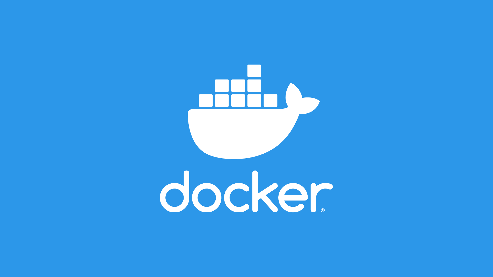

# С первого взгляда! / Подготавливаем бэкенд для приложения


Для начала давайте определимся с тем, что нам предстоит сделать на данном шаге. Чтобы разрабатывать функционал приложения, нам нужен HTTP Server, который сможет обрабатывать запросы от нашего приложения и выполнять необходимую логику, а также взаимодействовать с Telegram.

Для этих целей вы можете выбрать тот язык, инструмент или фреймворк, который позволяет создавать HTTP Server и писать на нём, в моём случае мой выбор остановился на TypeScript + Bun. Я не буду останавливаться на том, как создать с помощью них сервер, так как эта информация хорошо описана в официальной документации.

Вместо этого я сосредоточусь на том, чтобы объяснить схему работы нашего сервера и той части, которая отвечает за работу с Telegram, например, чтобы проверять авторизацию пользователя или выполнять платежи. К тому же, абсолютно весь код вы в любой момент можете посмотреть в репозитории в директории [backend](https://github.com/ykundin/at-first-sight/blob/backend).

[Документация по Bun](https://bun.sh/)

## Для чего нам Docker?



Уже сейчас наш проект состоит из двух микросервисов, каждый из которых выполняет свою определенную задачу:

- `/backend` — HTTP Server для авторизации, работы с данными, платежами и т.д.
- `/tg-web-app` — Отвечает за весь интерфейс, а позже будет работать с бэкендом

Но совсем скоро нам понадобится ещё как минимум два сервиса:

- `/database` — база данных для хранения информации о пользователях, платежах;
- `/object-storage` — хранилище файлов, чтобы безопасно хранить тысячи фотографий;

Запускать каждый из этих сервисов вручную и по отдельности может быть проблематично и надоедливо, а ведь потом это всё нужно будет запустить ещё и на боевом сервере. Разумеется, это уже никто не делает вручную и для этого есть свои инструменты, а один из самых известных — [Docker](https://www.docker.com/).

[Установить Docker](https://docs.docker.com/engine/install/)

## Контейнеризация приложения

Процесс упаковывания наших сервис внутрь Docker называется контейнеризацией. Давайте сделаем это для бэкенда и фронтенда нашего приложения, после чего мы сможем запускать весь проект одной командой.

1.  **Создаём `docker-compose.dev.yml`**

    Данный файл является конфигурацией для каждого из микросервисов, глядя на который можно сразу понять из чего состоит весь проект.
    Давайте для начала я добавлю в него лишь один сервис.

    ```yml
    version: "3.3"
    services:
      backend:
        image: oven/bun:1.0.3 # Мы используем Bun
        restart: always
        working_dir: /app
        ports:
          - 4000:4000 # Открываем порт для доступа
        volumes:
          - ./backend:/app:ro # Все файлы из директории /backend относятся к данному микросервису
        env_file:
          - ..env # А это файл с приватными переменными, например, токен для Telegram
        environment:
          - PORT=4000 # На этом порту будет запущен микросервис
        command: bun run dev # А это команда для запуска
    ```

2.  **А теперь добавим фронтенд**

    ```yml
    version: "3.3"
    services:
      backend:
        ...

     tg-web-app:
        image: oven/bun:1.0.4-alpine
        restart: always
        working_dir: /app
        ports:
          - 5173:5173
        volumes:
          - ./tg-web-app:/app
        env_file:
          - .env
        environment:
          - PORT=5173
        command: bun run dev
    ```

    Как видите, конфигурация довольно простая и очень похожа для каждого из сервисов и в этом прелесть Docker.

3.  **Обновляем команду для запуска проекта**

    А теперь добавим файл `package.json` в корень репозитория, чтобы добавить команду для запуска всего проекта одной командой.

    ```json
    {
      "name": "@at-first-sight/root",
      "scripts": {
        "dev": "docker-compose -f docker-compose.dev.yml up"
      },
      "type": "module"
    }
    ```

4.  **Запускаем проект в Docker**

    

    Теперь давайте остановим приложение, которое было у нас запущено во время разработки интерфейса и запустим команду `bun run dev` в корне репозитория. И Docker запустит для нас сразу два сервиса — бэкенд и фронтенд!

<br clear="right"/>

## Добавляем базу данных

Уже на следующем этапе разработки нам понадобится база данных для хранения данных о пользователях, поэтому давайте сразу добавим её в наш проект, пока мы недалеко ушли от Docker.

В качестве база данных я буду использовать [MongoDB](https://www.mongodb.com/), а для её добавления нам снова потребуется немного отредактировать `docker-compose.dev.yml`:

```yml
version: "3.3"
services:
  ...

  db:
    image: mongo:5.0.2
    restart: always
    env_file:
      - .env
    # Данные для подключения к базе данных (можно перенести в файл .env)
    environment:
      - MONGO_INITDB_ROOT_USERNAME=kundin
      - MONGO_INITDB_ROOT_PASSWORD=very-secret-password
      - MONGODB_DATABASE=at-first-sight
    ports:
      - 27017:27017
    volumes:
      - db_data:/data/db
      - ./mongo/docker-entrypoint-initdb.d:/docker-entrypoint-initdb.d:ro

volumes:
  db_data:
```

## Учимся делать запросы на бэкенд

Итак, у нас есть и бэкенд и фронтенд сервис, но осталось научиться выполнять запросы на свой же бэкенд и получать от него информацию. Давайте реализуем метод `getUser`, который пока что не будет возвращать реальную информацию (этим займёмся в следующей части), и этот метод мы будет вызывать при открытии приложения.

1. **Реализуем запрос на бэкенде**

   Здесь всё довольно просто и, скорее всего, даже не нуждается в комментариях:

   ```ts
   {
    method: "GET",
    path: "/api/get-user",
    handler() {
      return Promise.resolve({ ok: true, data: null });
    },
   }
   ```

   [Посмотреть весь код](https://github.com/ykundin/at-first-sight/blob/docs/backend/adapter/rest-api/auth.ts)

2. **Передаём адрес бэкенда во фронтенд-приложение**

   А вот здесь нам снова поможет Docker и файл `docker-compose.dev.yml`:

   ```yml
   version: "3.3"
   services:
     db:
      ...

     backend: # Название сервиса
       ...

     tg-web-app:
       ...
       environment:
         - PORT=5173
         - BACKEND_URL=http://backend:4000 # Добавляем адрес бэкенда в виде названия сервиса
   ```

3. **Проксируем запросы к API**

   А теперь мы с вами сделаем так, что абсолютно все запросы, которые начинаются с `/api` будут автоматически отправляться на наш бэкенд-сервис. Это называется проксированием запросов и сильно упрощает интеграцию с бэкендом. С помощью Vite это реализуется буквально несколько строками в файле `/tg-web-app/vite.config.ts`:

   ```ts
   import { defineConfig } from "vite";
   import react from "@vitejs/plugin-react";

   // https://vitejs.dev/config/
   export default defineConfig({
     server: {
       port: Number(process.env.PORT) || 3000,
       proxy: {
         "/api": {
           target: process.env.BACKEND_URL, // Тот самый адрес, который мы указали в docker-compose.dev.yml
         },
       },
     },
     plugins: [react()],
   });
   ```

4. **Добавляем QueryClient**

   Работа с запросами заключается в том, что нам нужно будет получать статус запроса, необходимые данные, кэшировать запросы, чтобы не делать один и тот же запрос заново, обновлять полученную информацию через какое-то время, обрабатывать ошибки и много чего ещё. И весь этот функционал уже давно реализован в отдельным библиотеках, например, в [ReactQuery](https://tanstack.com/).

   Давайте установим её в наше фронтенд-приложение:

   ```bash
   cd tg-web-app
   bun install @tanstack/react-query
   ```

   И создадим клиент на уровне всего приложения, то есть в файле `App.tsx`:

   ```tsx
   import { QueryClient, QueryClientProvider } from "@tanstack/react-query";

   function App() {
     const queryClient = new QueryClient();
     const router = createBrowserRouter(...);

     return (
       <QueryClientProvider client={queryClient}>
         <RouterProvider router={router} />
       </QueryClientProvider>
     );
   }

   export default App;
   ```

5. **Получаем информацию о пользователе**

   А теперь последний шаг, на котором мы напишем кастомный хук `useUser`, который будет отправлять запрос на бэкенд и возвращать нам информацию о текущем пользователе:

   ```ts
   import { useQuery } from "@tanstack/react-query";

   function useUser() {
     return useQuery({
       queryKey: ["user"],
       queryFn: async () => {
         // А вот и сам запрос на наш бэкенд
         const res = await fetch("/api/get-user");
         const result = await res.json();

         if (!result.ok) {
           throw new Error(result.error);
         }

         return result.data;
       },
     });
   }

   export default useUser;
   ```

   [Посмотреть внутри компонента](https://github.com/ykundin/at-first-sight/blob/docs/tg-web-app/src/screens/welcome-screen/elems/start-step/start-step.tsx)

Всё! Теперь у нас есть абсолютно всё необходимое для того, чтобы реализовать регистрацию и авторизацию пользователей внутри приложения.

[Регистрация и авторизация](./07-auth-reg.md)
