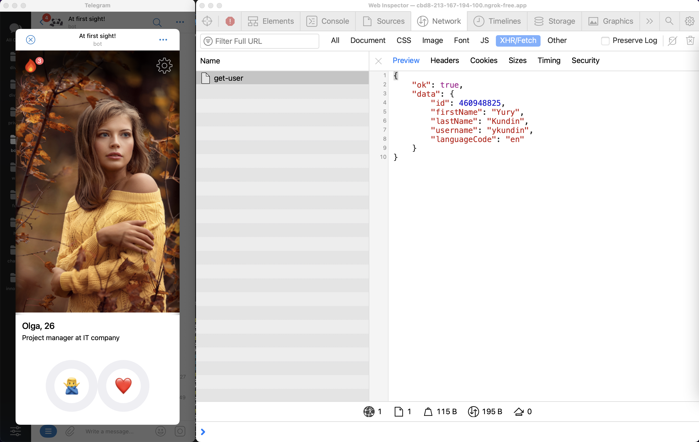
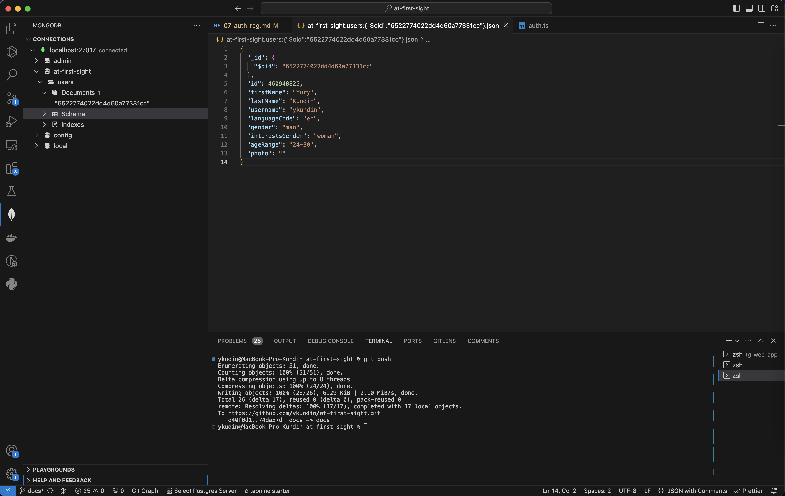
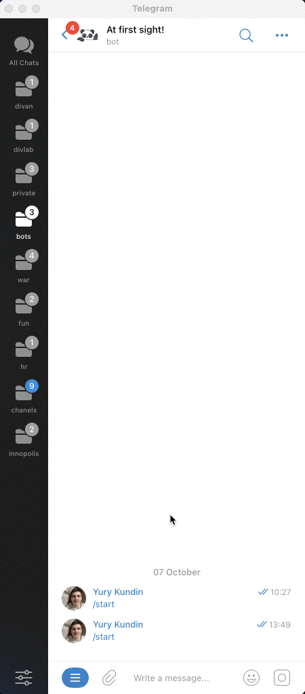

# С первого взгляда! / Регистрация и авторизация

Наша с вами задача на данном шаге — реализовать регистрацию пользователя при первом входе в наше приложение, а при повторном автоматически проходить авторизацию. Я постараюсь подробно разобрать схему работы и те возможности, которые нам предоставляет Telegram, но кода уже будет заметно больше, поэтому не стесняйтесь заглядывать прямо в код (особенно на класс Auth).

## Получение информации о пользователе



На самом деле во время открытия приложения Telegram сразу предоставляет нам информацию о пользователе. Но для того, чтобы убедиться в том, что эту информацию не подделали Telegram предоставляет алгоритм для проверки данных — [смотреть в документации](https://core.telegram.org/bots/webapps#validating-data-received-via-the-mini-app).

1. **Отправляем initData**

   Для начала давайте слегка перепишем хук `useUser` и будем передавать на бэкенд всю информацию, которую предоставляет нам Telegram:

   ```tsx
   import { useQuery } from "@tanstack/react-query";

   function useUser() {
     return useQuery({
       queryKey: ["user"],
       queryFn: async () => {
         // eslint-disable-next-line @typescript-eslint/no-explicit-any
         const initData = (window as any).Telegram.WebApp.initData; // Информация от Telegram

         // Отправим эту информацию на бэкенд с помощью POST-метода и JSON
         const res = await fetch(`/api/get-user`, {
           method: "POST",
           headers: {
             ContentType: "application/json",
           },
           body: JSON.stringify({ initData }),
         });
         const result = await res.json();

         if (!result.ok) {
           throw new Error(result.error);
         }

         return result.data;
       },
     });
   }

   export default useUser;
   ```

2. **Проверяем пользователя на бэкенде**

   А теперь реализуем алгоритм для проверки той информации, которую мы получили от клиента, чтобы убедиться, что она действительно корректная и ей можно доверять:

   ```tsx
   import crypto from "node:crypto";
   import { ValidationError } from "../app/errors/validation-error";

   class Auth {
     getUserByInitData(inputInitData: string): User {
       const initData = new URLSearchParams(inputInitData || "");
       const inputUser = initData.get("user") || "null";
       const inputHash = initData.get("hash") || "";

       // Используем токен от BotFather
       const token = process.env.TELEGRAM_BOT_API || "";

       // Подготавливаем параметры
       const inputParams: {
         key: string;
         value: string;
       }[] = [];
       initData.forEach((value, key) => {
         if (key === "hash") return;
         inputParams.push({ key, value });
       });

       const sortedInputParams = inputParams.sort((a, b) => {
         return a.key.localeCompare(b.key);
       });

       const dataCheckString = sortedInputParams
         .map(({ key, value }) => `${key}=${value}`)
         .join("\n");

       // Формируем новый хэш и проверяем, что он совпадает с тем, что передал нам Telegram
       const secretKey = crypto
         .createHmac("sha256", "WebAppData")
         .update(token);
       const baseHash = crypto
         .createHmac("sha256", secretKey.digest())
         .update(dataCheckString)
         .digest("hex");

       if (baseHash !== inputHash) {
         throw new ValidationError({
           field: "hash",
           message: "Incorrect auth hash",
         });
       }

       try {
         // Если всё хорошо, то информации можно доверять
         const tgUser = JSON.parse(inputUser);

         return {
           id: tgUser.id,
           firstName: tgUser.first_name,
           lastName: tgUser.last_name,
           username: tgUser.username,
           languageCode: tgUser.language_code,
         };
       } catch (e) {
         throw new ValidationError({
           field: "user",
           message: "Incorrect format of user",
         });
       }
     }
   }
   ```

3. **Работа с токеном**

   Обратите внимание, что внутри алгоритма нам нужен секретный токен, который мы получили от BotFather во время регистрации нашего бота. Крайне не рекомендую сохранять данный токен в коде приложения, так как данный токен даёт полный доступ к вашему боту и это не безопасно.

   Вместо этого используют так называемые переменные окружения, которые сохраняются в файле `.env`, а затем их можно получать внутри кода приложения с помощью вот такой записи — `process.env.TELEGRAM_BOT_API`, где `TELEGRAM_BOT_API` это название переменной и может быть любым.

   Данный файл не должен находиться в Git-репозитории, поэтому проследите, что он был добавлен в `.gitignore`. Содержимое файла для примера:

   ```bash
   TELEGRAM_BOT_API=6406180840:AAFpHAa-a5IMDM25kef2tbScNCX8PjKy2a
   ```

## Регистрация пользователя

Логика регистрация пользователя никак не зависит от Telegram и может различаться в зависимости от типа приложения, а некоторым приложениям это вообще не нужно. В нашем приложении регистрация пользователя нужна, поэтому я коротко расскажу о самом важном в этом процессе.

1. **Отправляем запрос на регистрацию**

   Для начала нужно реализовать передачу всех данных для регистрации со стороны приложения. В моём случае при первом визите в приложение у пользователя есть экран с дополнительными вопросами. После ответа на все вопросы, мы просим пользователя выбрать фотографию, а затем отправляем это на бэкенд в виде POST-запроса на адрес `/api/registration`.

   [Посмотреть код компонента](https://github.com/ykundin/at-first-sight/blob/docs/tg-web-app/src/screens/welcome-screen/elems/messages-step/messages-step.tsx) (ищите функцию `handleSubmit`)

2. **Пишем обработчик запроса**

   А теперь необходимо добавить обработчик на бэкенде для данного запроса:

   ```tsx
   {
       method: "POST",
       path: "/api/registration",
       async handler({ request }) {
         const auth = new Auth();
         const tgUser = auth.getUserByInitData(request.body.get("initData"));
         const user = await auth.register(request.body, tgUser);

         return {
           ok: true,
           data: user,
         };
       },
     },
   ```

3. **Реализуем регистрацию**

   Как видите, обработчик запроса служит лишь для того, чтобы вызвать нужный метод в классе `Auth`, передав в него информацию из запроса. Давайте детальнее посмотрим на этот класс и метод `register`:

   ```tsx
   import crypto from "node:crypto";
   import { MongoClient } from "mongodb";

   import { ValidationError } from "../app/errors/validation-error";

   import type { Collection, Db } from "mongodb";

   class Auth {
     #cookieName = "session_id";

     #client: MongoClient;
     #db: Db;
     #users: Collection<User>;

     constructor() {
       this.#client = new MongoClient(process.env.MONGO_URI || "");
       this.#db = this.#client.db(process.env.MONGO_DB || "");
       this.#users = this.#db.collection("users");
     }

     async saveUser(user: User): Promise<boolean> {
       const result = await this.#users.insertOne(user);

       return result.acknowledged;
     }

     async getUserById(userId: User["id"]): Promise<User | null> {
       const user = await this.#users.findOne({ id: userId });

       return user;
     }

     async register(form: FormData, tgUser: TelegramUser): Promise<User> {
       // TODO: Add the validation of form data

       // Maybe user already exists?
       const dbUser = await this.getUserById(tgUser.id);
       if (dbUser) {
         return dbUser;
       }

       const user = {
         ...tgUser,
         gender: String(form.get("gender")) || "",
         interestsGender: String(form.get("interests")) || "",
         ageRange: String(form.get("age-range")) || "",

         // TODO: Upload photo to Object Store
         photo: "",
       };

       await this.saveUser(user);

       return user;
     }
   }

   export default Auth;
   ```

   Как видите, на данном этапе я полностью пропустил стадию с валидацией полученных данных, а также не реализовал логику с сохранением фотографии пользователя. Но, разумеется, это обязательно сделать до того, как ваше приложение попадёт в продакшн. Мы займёмся этим чуть позже.

   [Открыть файл](https://github.com/ykundin/at-first-sight/blob/docs/backend/app/auth.ts)

4. **Взаимодействие с базой данных**

   

   А также обратите внимание на конструктор внутри класса `Auth` — здесь мы создаём соединение с базой данных, а все необходимые данные для этого берём из переменных окружения. А значит пришла пора отредактировать файл `.env`:

   ```bash
   TELEGRAM_BOT_API=6406180840:AAFpHAa-a5IMDM25kef2tbScNCX8PjKy2a
   MONGO_URI=mongodb://kundin:very-secret-password@db:27017/?authSource=admin&readPreference=primary&ssl=false&directConnection=true
   MONGO_DB=at-first-sight
   ```

   Все необходимые параметры для базы данных мы с вами уже указали в файле `docker-compose.dev.yml`. Обратите внимание, что для применения новых переменных окружения необходимо полностью перезапустить приложение в Docker. А для того, чтобы удобно смотреть то, что было в итоге сохранено в базу данных я рекомендую установить [расширение для VS Code](https://github.com/mongodb-js/vscode).

## Авторизация пользователя



В нашем приложении будет довольно много API-методов, которые должны быть доступны только для авторизованных пользователей, но проверять каждый пользователя через `initData` от Telegram неудобно и приводит к тому, что эта часть кода будет повторяться из раза в раз.

Поэтому давайте напишем простую авторизацию пользователя с помощью `cookie`, в котором мы будем хранить идентификатор сессии. Если пользователь приходит к нам с `cookie`, то мы попробуем получить всю необходимую информацию о нём по идентификатору, вместо `initData`. В данном примере намерено показано самая простая логика авторизация без использования фреймворков и готовых решений, чтобы объяснить принцип их работы.

1. **Добавляем код для работы с сессией**

   Начнём с того, что добавим в класс `Auth` два метода для создания сессии и для получения информации о пользователе из сессии (сессия это обычная коллекция в базе данных):

   ```tsx
   import { nanoid } from "nanoid";
   import { MongoClient } from "mongodb";
   import { ValidationError } from "../app/errors/validation-error";
   import type { Collection, Db } from "mongodb";
   import type { User } from "../domain/user";

   interface Session {
     id: string;
     userId: User["id"];
   }

   class Auth {
     #cookieName = "session_id";
     ...
     #sessions: Collection<Session>;

     constructor() {
       ...
       this.#sessions = this.#db.collection("sessions");
     }

     get cookieName(): string {
       return this.#cookieName;
     }

     async getUserById(userId: User["id"]): Promise<User | null> {
       ...
     }

     async createSession(userId: User["id"]): Promise<string | null> {
       const sessionId = nanoid();
       const result = await this.#sessions.insertOne({
         id: sessionId,
         userId: userId,
       });

       return result.acknowledged ? sessionId : null;
     }

     async getUserFromSession(sessionId: string): Promise<User | null> {
       const session = await this.#sessions.findOne({ id: sessionId });
       const user = session ? await this.getUserById(session.userId) : null;

       return user;
     }
   }
   ```

   Обратите внимание, что идентификатор сессии всегда уникален, поэтому я использую небольшую библиотеку `nanoid` для этой задачи, не забудьте её установить в сервис `backend`: `bun install nanoid`;

2. **Сохраняем сессию после регистрации**

   А теперь слегка отредактируем код обработчика регистрации, чтобы после успешной регистрации мы добавили пользователю `cookie` с идентификатором сессии. Именно этот идентификатор позволит нам понять, что пользователь уже авторизован, когда тот будет выполнять другие запросы.

   ```tsx
   // file /backend/adapter/rest-api/auth.ts
   {
    method: "POST",
    path: "/api/registration",
    async handler({ request, response }) {
      const auth = new Auth();
      const tgUser = auth.getUserByInitData(request.body.get("initData"));
      const user = await auth.register(request.body, tgUser);
      const sessionId = await auth.createSession(user.id);

      if (user) {
        const sessionId = await auth.createSession(user.id);

        // Save the sessionId in cookie
        if (sessionId) {
          response.setCookie(auth.cookieName, sessionId, {
            secure: true,
            httpOnly: true,
          });
        }
      }

      return {
        ok: true,
        data: user,
      };
    },
   },
   ```

3. **Добавляем пользователя в каждый обработчик**

   А теперь мы сделаем то, ради чего всё и задумывалось — информация о пользователе будет доступна в каждом обработчике запроса и мы сможем сразу использовать его для написания нужной логики. Для этого будет пытаться получить пользователя из `cookie` перед началом обработчика:

   ```tsx
   // file /backend/infra/bun-http-server.ts

   // Try to find user by sessionId in cookies
   const cookies = cookie.parse(req.headers.get("Cookie") || "");
   const sessionId = cookies[this.#auth.cookieName];
   const user = await this.#auth.getUserFromSession(sessionId);

   ...
   // Add the user to every request handler
    const result = await route.handler({ request, response, user });
   ```

4. **Что изменилось?**

   Теперь если мы захотим сделать обработчик запроса, который доступен только для авторизованных пользователей, то код станет сильно проще в понимании и написание, например:

   ```tsx
   {
    method: "POST",
    path: "/api/unlock-profile",
    before: [shouldBeAuth],
    async handler({ request, user }) {
      if (!user) {
        throw new Error('User not authorized!');
      }

      return ...
    },
   }
   ```

Ещё больше примеров такого подхода вы увидите в следующих этапах разработки и быстро поймёте преимущества. Разумеется, это один из самых простых механизмов авторизации, который может иметь некоторые проблемы с безопасностью, но он отлично описывает общий принцип авторизации с помощью `cookie`.

А сейчас нам с вами пора разобрать самую интригующую тему — работу с платежами!

[Платежи внутри Telegram Web App](./08-payments.md)
