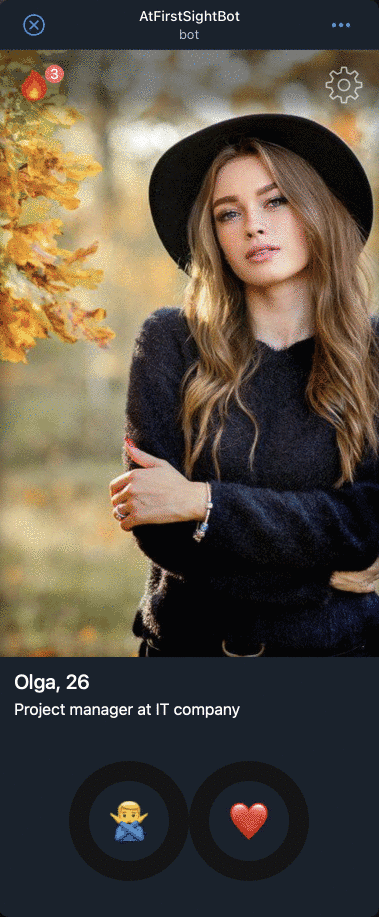

# С первого взгляда! / Платежи внутри Telegram Web App



Telegram предоставляет вашему приложению возможность проведения платежей прямо внутри приложения, что открывает огромный простор для возможностей монетизации приложений и предоставления платных услуг.

Например, у каждого пользователя есть дневной лимит на просмотр анкет других людей, который обновляется ежедневно. Но также мы предоставляем возможность пользователю увеличить лимит, оплатив виртуальный товар прямо через Telegram.

Давайте рассмотрим основные этапы работы с платежами на данном примере.

## 1. Подключение провайдера

Telegram предоставляет доступ ко многим платежным провайдерам, список которых к тому же постоянно обновляется. И в первую очередь вам необходимо подключить одного или нескольких платежных провайдеров внутри настроек вашего бота (используйте @BotFather).

У каждого провайдера могут быть свои условия для проведения платежей и это выходит за рамки инструкции, но также каждый провайдер предоставляет тестовый режим, который удобен во время разработки и тестирования (я буду использовать провайдер YOOKASSA).

## 2. Сохраняем доступ

Каждый провайдер после подключения предоставляем определенный уникальный токен, который необходимо положить в `.env`. Мы будем использовать его во время создания платежей:

```bash
TELEGRAM_YOOKASSA_TOKEN=381764678:TEST:68550 # Payment provider token from @BotFather
```

## 3. Создаём платеж

Логика приложения и варианты платных услуг могут быть совершенно разными, но всё начинается с того, что мы создаём новый платеж с помощью Telegram Bot API на своём собственном бэкенде:

```ts
class Payments {
  createInvoiceLink(order: Order): Promise<string> {
    const link = this.#botApi.query<string>("createInvoiceLink", {
      title: "Buy 100 scores",
      description: "You will get another 100 points to evaluate other people",
      currency: "RUB",
      prices: [
        {
          label: "Price",
          amount: 100 * 100,
        },
      ],
      // Любая дополнительная информация на ваше усмотрение
      payload: JSON.stringify({
        paymentId: "test",
        currentUserId: params.currentUserId,
        scores: 100,
      }),
      provider_token: process.env.TELEGRAM_YOOKASSA_TOKEN,
    });

    return link;
  }
}
```

Если всё прошло успешно, то в ответ на данный запрос Telegram вернёт нам ссылку на платёж, которую нужно открыть внутри Web App с помощью
метода [openInvoice](https://core.telegram.org/bots/webapps#initializing-mini-apps):

```ts
const res = await fetch("/api/buy-scores", ...);
const result = await res.json();

if (!result.ok) {
    alert("Unknown error, try again");
    return;
}

// result.data its a payment link from Telegram
webApp.openInvoice(result.data, (status: string) => {
    if (status === "paid") {
        console.log('Success payment!');
    }
});
```

Сразу после этого у пользователя будет открыто окно внутри приложения со всей информацией о вашей услуге и возможностью её оплатить с помощью того провайдера, которого вы выбрали на первом шаге.

## 4. Получение информации о платеже

Но после того, как пользователь введёт все необходимые данные и нажмёт на оплату, нашему бэкенду нужно каким-то образом получить информацию о том, что такой платеж совершен, проверить его и предоставить услугу пользователю (в нашем случае снять ограничение).

- **Настраиваем webhook**
  Для того, чтобы иметь возможность получать от Telegram всю необходимую информацию, мы должны сообщить ему URL-адрес бэкенда, на который он сможет её отправлять. Обычно это выглядит примерно так:

  ```ts
  async setWebhook() {
    const url = process.env.PUBLIC_URL || "";

    return this.query("setWebhook", { url: `${url}/webhook` });
  }
  ```

- **Проверяем платеж**
  Если всё сделано правильно, то теперь на адрес `/webhook` мы будем получать информацию о платежах:

  ```ts
    {
      method: "POST",
      path: "/webhook",
      async handler({ request }) {
        const botApi = new TgBotApi();

        // TODO: Check the payment!
        if (request.body.pre_checkout_query) {
          await botApi.query("answerPreCheckoutQuery", {
            ok: true,
            pre_checkout_query_id: request.body.pre_checkout_query.id,
          });
        }

        // Info about success payment
        if (request.body.message?.successful_payment) {
          const payment = request.body.message.successful_payment;
          const payload = JSON.parse(payment.invoice_payload);

          console.log("New payment", payment);
        }

        return { ok: true };
      },
    },
  ```

На самом деле это лишь один из самых простых вариантов проведения платежа, который показывает лишь общую схему работы и нуждается в доработках, прежде чем начать использовать это в реальных платежах. Более подробную информацию о платежах вы можете узнать в официальной документации Telegram — [Payments API](https://core.telegram.org/bots/payments)
